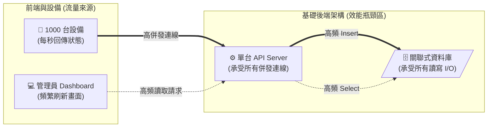
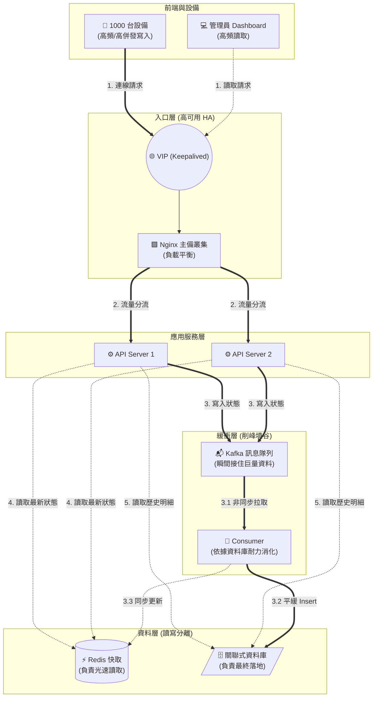
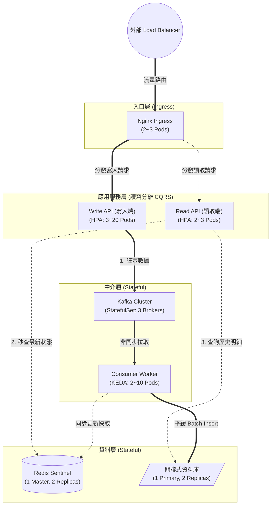

# 從被問倒到打怪升級：圖解高頻寫入與高可用架構演進史

## 前言：一場面試帶來的架構震撼教育
今天去面試時，面試官拋出了一個問題：「如果是設備監控系統，當同時有 1000 台以上的設備回傳狀態時，你會怎麼寫入資料庫？」

當時的我根本沒遇過高頻跟高併發的情境，當下只是滿頭問號看著他，心想：「阿不就把資料寫進資料庫嗎？寫個 `INSERT INTO` 語法不就好了，這有什麼好問的？」

想當然爾，面試結束後我還是一臉懵，直到回來的路上跟學姊討論才發現原來資料量大到一個程度時會產生「高頻海量數據寫入」的致命效能瓶頸，這瞬間激起了我的好奇心於是在回程的車上我直接開了 Gemini 一路追問到底，這才終於推開了後端架構的另一扇大門也深刻體會到自己原本的想法有多麼井底之蛙，這篇筆記就是這趟探索之旅的總結。

{/* truncate */}

---

## 🎯 設備監控系統：海量數據的架構演進史

當系統面臨上千台設備每秒連續回傳狀態時，傳統那種「API 收到資料就直接 Insert 進資料庫」的寫法會因為瞬間湧入的大量併發連線先壓垮 API Server，且後續瘋狂的高頻寫入也會讓資料庫的磁碟 I/O 直接癱瘓，所以我們必須在架構上進行分層擊破。

在面對**高併發連線**時，我們會在最前方加上 Nginx 當作反向代理把海量連線平均分發給後端多台 API Server，接著為了解決**高頻寫入**，API Server 收到資料後不再直接操作資料庫而是極速丟進 Kafka 訊息隊列，再由後方的 Consumer 慢慢把資料拉出來做 Batch Insert 藉由這種「削峰填谷」來保護資料庫。

除此之外為了應付管理員在 Dashboard 上的**高頻讀取**需求，我們引入 Redis 當作記憶體快取，Consumer 在寫入資料庫存檔的同時順手把最新狀態覆蓋到 Redis 裡，往後所有的即時查詢都只會命中極速的 Redis 從而徹底解放資料庫的讀取壓力並落實資料分級。

到了架構成熟期為了解決伺服器的單點故障並實現**高可用性 (HA)**，我們會幫 Nginx 綁定 Keepalived 虛擬 IP 並幫 Redis 配置 Sentinel 哨兵模式以確保任何一台當機時都能在幾秒內無縫切換到備援機，最後若將系統搬上 Kubernetes 我們更會導入 CQRS 讀寫分離的微服務概念把 API 徹底拆分成負責接流量的 Write API 與負責供查詢的 Read API，讓兩條動線完全解耦且能獨立自動擴縮容，這才算是一個真正具備彈性與高容錯的現代化監控架構。

---

## 1. 核心名詞定義（先搞懂這三個術語）

為了解決系統崩潰的問題，我們得先搞懂這三個常被混淆、卻又息息相關的名詞：

- **高併發 (High Concurrency)**：
  - **白話說**：系統在「同一個瞬間」能同時接待多少個請求，考驗的是系統的寬度。
  - **痛點**：1000 台設備「同時」打 API 對 Server 來說就是瞬間爆出 1000 個連線，如果伺服器的執行緒或記憶體不夠，來不及處理的連線就會被塞在門口排隊甚至直接被踢掉（Timeout 或 Connection Refused）。
  
- **高頻 (High Frequency)**：
  - **白話說**：特定動作發生的「頻率極高」且「連續不斷」，考驗的是系統的持久耐力與吞吐量（每秒能讀寫幾次）。
  - **痛點**：這 1000 台設備不是傳一次就沒事了而是「每秒」都在狂傳，這會對資料庫產生極高頻率的連續寫入壓力，像 MySQL 這種傳統資料庫面對這種狀況很容易因為硬碟 I/O 跟不上或是資料表被 Lock 死而直接把整個系統拖垮。

- **高可用性 (High Availability, HA)**：
  - **白話說**：系統的「容錯與備援能力」，就算硬體壞了或軟體當機系統也能在極短時間內自動恢復，達到「服務幾乎不中斷」的境界。
  - **痛點**：假設所有設備都只連同一台 API Server 只要這台機器一壞（這叫單點故障 SPOF），1000 台設備就會瞬間全部斷線且資料也會跟著遺失，高可用性就是為了防範這種毀滅性災難。

---

## 2. 如果用最原始的一條龍架構會怎樣？

**情境設定**：
我們以「設備監控系統」為例，假設有 1000 台設備每秒回傳一次狀態而且每次回傳裡面有 1000 個數據點。

**原始資料流程**：
一開始最直覺的寫法通常是一條龍的，包含「寫入」與「讀取」兩條動線：
1. **寫入動線**：`感測器回傳狀態` ➡️ `API Server 接收` ➡️ `寫入資料庫`
2. **讀取動線**：`管理員打開 Dashboard 網頁` ➡️ `API Server 接收請求` ➡️ `去資料庫撈最新狀態` ➡️ `回傳畫面`

---

> ⚠️ **會發生什麼慘劇？**
> 這個架構在設備跟使用者都不多的時候沒什麼感覺，但如果在「1000 台設備每秒同時回傳」的規模下瞬間的高併發絕對會壓垮那台可憐的 API Server，且它瘋狂 Insert 的動作也會引發高頻寫入問題直接塞爆資料庫的硬碟 I/O，這時候如果還疊加了「多位管理員同時打開 Dashboard 瘋狂 F5 刷新畫面」的高頻讀取需求，本來就在苦撐的資料庫就會徹底死當。

所以我們必須把架構拆開來，一關一關解決：

---

## 3. 實際架構演進與解法

當這 1000 台設備透過 API Server 將數據寫入系統時，每一層都會面臨不同的壓力我們得這樣解：

### 第一關：解決 API Server 的「高併發」被塞爆
- **解法：加上 Nginx 做負載平衡 (Load Balancing)**
  - 我們在最前面用 Nginx 當作反向代理入口，把大量併發請求「平均分發」給後端多台 API Server 處理這樣就不怕單一伺服器被壓垮了。
- **👉 白話舉例**：想像設備是 1000 個同時衝進餐廳的客人而單台 API 就是唯一的服務生，他絕對會崩潰，所以 Nginx 就像門口的帶位主管他不端菜只負責看哪桌服務生比較閒就把客人帶過去，大家分攤著接待就不會有人累垮。

### 第二關：解決資料庫的「高頻寫入」卡死
- **解法：用 Kafka 訊息隊列 (Message Queue) 來削峰填谷**
  - API Server 收到數據後不要直接存資料庫而是快速丟進 Kafka（它寫入效能超強不怕大流量），接著由後端的 Consumer 程式依照資料庫吃得消的速度慢慢把資料拉出來存進 DB（或是湊多筆一起做 Batch Insert）藉此保護資料庫。
- **👉 白話舉例**：API 就像瘋狂點手搖飲的客人而資料庫是動作很慢的搖飲料店員，如果客人一直對著店員喊店員絕對會當機，所以 Kafka 就像櫃檯的點餐機跟訂單籃讓客人點完單把單子丟進去就可以去旁邊滑手機了，店員只要照著自己的節奏慢慢把單子拿出來做就好，這就是所謂的「削峰填谷」。

### 第三關：解決 Nginx 的「單點故障」問題 (落實 HA)
- **解法：Keepalived + 雙 Nginx 備援**
  - 如果入口的 Nginx 壞了所有人一樣全斷，所以我們要架兩台 Nginx（一台 Master、一台 Backup）並透過 Keepalived 共用一個「虛擬 IP（VIP）」，設備只要連這個 VIP 就好讓主 Nginx 發生故障時 Keepalived 可以在幾秒內把 VIP 轉移到備援機上實現服務幾乎無縫接軌。
- **👉 白話舉例**：VIP 就像 0800 客服專線讓客戶只認這支號碼，而 A 員工(主機)跟 B 員工(備援)負責接聽且 Keepalived 就是主管，平常主管把專線接給 A 但如果 A 突然暈倒主管會瞬間把線路拔過去插給 B，這樣對客戶來說電話完全不會斷。

### 第四關：解決 Dashboard 即時監控的「高頻讀取」
- **解法：Redis 記憶體快取 (Cache)**
  - 如果 100 個管理員同時打開網頁看最新狀態且每次都去查 DB 絕對會拖垮系統，所以 Consumer 在寫入 DB 備份時會同步更新一份最新狀態到 Redis 中，這樣管理員的請求一律只去查 Redis，因為它是長在記憶體裡的所以讀取速度是硬碟的千百倍。
- **進階機制 (TTL / LRU)**：記憶體很貴不能無限塞所以我們會設定 TTL 讓資料定時過期自動清空，如果空間滿了 Redis 也會啟動 LRU 機制把「最久沒人看的冷門資料」踢掉以保留最常查的熱門狀態。
- **👉 白話舉例**：管理員就像一直打來問今天有沒有賣珍奶的客人而資料庫是必須跑到倉庫翻庫存表的店長，一直問他會累死，所以 Redis 就像掛在店門口的小黑板讓店長查完一次就把答案寫上去，之後 1000 個客人來只要看一眼黑板就好而完全不用再去煩店長。

---

### 💡 進階高可用架構全貌

把上面四個解法串聯起來，就會得到一個非常強健、能扛大流量的現代化架構：

---

### 🚀 延伸探討：如果改用 Kubernetes (K8s) 實作

如果我們把這個架構搬到現代化的 Kubernetes (K8s) 雲端容器平台，原本的每一台「實體伺服器」都會變成 K8s 裡的「資源物件」，K8s 最強大的地方在於 HPA (自動擴縮容) 功能，它能根據當下的 CPU/記憶體使用率或是訊息隊列的積壓狀況自動去增減機器的數量。

#### K8s 各層級配置建議：

1. **入口層 (Ingress)**
   - **Nginx Ingress Controller**：直接取代傳統的實體 Nginx + Keepalived，通常固定配置 2~3 個 Pods 且由雲端供應商的 Load Balancer 負責把外部流量打進來，天生具備高可用性。
2. **無狀態應用層 (微服務讀寫分離 / CQRS)**
   - **Write API (寫入專用)**：負責接設備的高頻數據回傳，設定 HPA 後平常維持 3 個 Pods，流量暴增時就可以擴展到 20 個 Pods 去扛。
   - **Read API (讀取專用)**：給 Dashboard 查詢狀態用，因為讀取頻率較低而且有 Redis 擋住所以維持 2~3 個 Pods 就夠了，就算 Write API 寫到當機 Read API 一樣活得好好的，這就是故障隔離的好處。
   - **Consumer Worker**：搭配 KEDA (基於事件的自動擴縮) 後平常維持 2 個 Pods，一旦偵測到 Kafka 積壓的訊息太多來不及消化就自動長出 10 個 Pods 來幫忙消耗。
3. **有狀態儲存層 (Stateful)**
   - **Kafka**：用 `StatefulSet` 部署並配置 3 個 Brokers (Pods) 來達成叢集高可用與資料備援。
   - **Redis**：一樣用 `StatefulSet` 並配置 1 台 Master + 2 台 Replicas 的架構（通常交給 Redis Sentinel 或 Operator 管理）。
   - **關聯式資料庫 (DB)**：通常也是 1 台 Primary (寫入主機) + 2 台 Replicas (讀取備援) 來做到讀寫分離。

#### K8s 實體配置對應圖（導入 CQRS 讀寫分離）：

