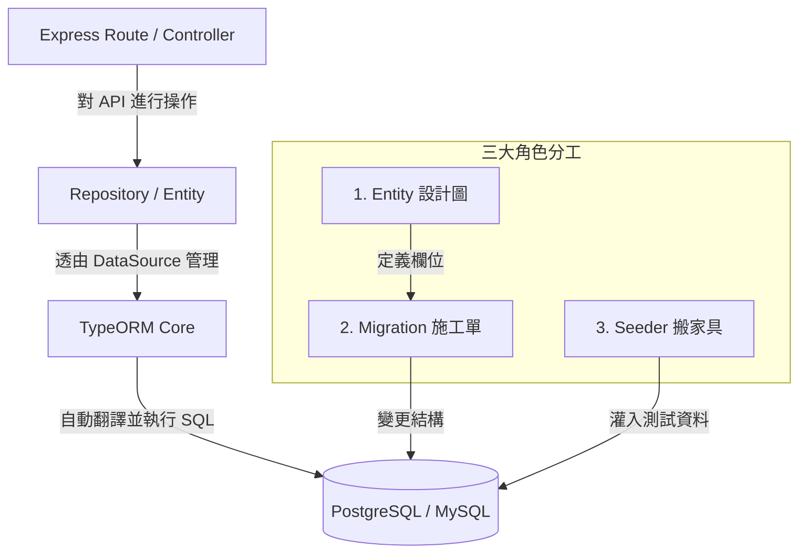

import Head from '@docusaurus/Head';
import Tabs from '@theme/Tabs';
import TabItem from '@theme/TabItem';

<Head>
  <script type="application/ld+json">
    {`
      {
        "@context": "https://schema.org",
        "@type": "Article",
        "headline": "TypeORM 基礎概念、三大角色與實戰指南",
        "datePublished": "2026-08-01T19:03:00.000Z",
        "author": [{
            "@type": "Person",
            "name": "liwen"
        }],
        "description": "本篇筆記為 TypeORM 入門與實戰指南。從 ORM 的基本概念、為什麼要使用 TypeORM、專案架構圖，到三大核心角色（Entity 設計圖、Migration 施工單、Seeder 搬家具）的完整介紹與範例程式碼，幫助你快速掌握 Node.js / Express 開發中的資料庫管理。"
      }
    `}
  </script>
</Head>


# TypeORM 基礎概念、三大角色與實戰指南

在現代後端開發中，直接撰寫原生 SQL 指令雖然直覺，但隨著專案規模擴大，資料庫結構維護與程式碼管理會變得相當繁瑣。TypeORM 作為 Node.js 生態系中最熱門的 ORM 套件之一，提供了一套優雅的物件導向模型來與關聯式資料庫互動。本篇筆記將透過淺顯易懂的圖文說明，帶你了解 TypeORM 的核心價值、架構圖，以及驅動資料庫管理的三大核心角色。

---

## 一、介紹 TypeORM

### 什麼是 ORM？
**ORM (Object-Relational Mapping，物件關聯對映)** 是一種程式設計技術。它的目的在於作為**後端程式語言 (JavaScript/TypeScript)** 與 **關聯式資料庫 (PostgreSQL, MySQL 等)** 之間的橋樑。

簡單來說：
- **傳統方式**：你必須手寫 `SELECT * FROM "users" WHERE id = 1;` 這樣的原生 SQL 字串。
- **ORM 方式**：你只需要寫 `userRepository.findOneBy({ id: 1 })`，ORM 就會自動幫你翻譯成對應的 SQL 語法去向資料庫拿資料，並把結果轉成 JavaScript 物件。

### 什麼是 TypeORM？
**TypeORM** 是專為 JavaScript (Node.js) 與 TypeScript 設計的 ORM 套件。它支援最新的 ES6/TypeScript 特性，並且可以搭配各種常見的關聯式資料庫（如 PostgreSQL、MySQL、SQLite、MariaDB 等）。

---

## 二、為什麼要用 TypeORM？

在開發 Node.js 後端服務時，引入 TypeORM 主要有以下 5 大優點：

:::info[💡 為什麼不直接手寫 SQL？]
直接手寫 SQL 字串容易因為拼字錯誤而產生 Runtime Error，且跨團隊開發時很難追蹤資料庫欄位到底被誰改過。
:::

1. **語意化操作（物件化 CRUD）**：
   使用物件導向的方法進行增刪查改（如 `.find()`, `.save()`, `.delete()`），讓程式碼更直覺且易於維護。
2. **結構版本控制（Migration 施工單）**：
   就像 Git 控管程式碼版本一樣，Migration 可以紀錄每次資料庫結構（Table / Column）的異動，確保團隊成員與線上環境的資料庫結構完全一致。
3. **自動防範 SQL 注入（SQL Injection）**：
   TypeORM 內建參數化查詢 (Parameterized Queries)，會自動轉義使用者輸入的危險字元，大幅提升系統資安防範能力。
4. **跨資料庫相容性**：
   底層 SQL 語法交給 TypeORM 處理。如果未來專案要從 SQLite 切換到 PostgreSQL，絕大多數的程式碼邏輯都不需要重新撰寫。
5. **強大的型別提示（TypeScript 支援）**：
   搭配 TypeScript 或 EntitySchema，開發時編輯器會自動提供欄位名稱與型別補完，大幅減少開發中的人為失誤。

---

## 三、TypeORM 結構圖

了解 TypeORM 在專案中的位置與檔案目錄結構，能幫助你建立清晰的開發全貌。

### 1. 系統運作架構圖



### 2. 專案目錄結構

在標準的 Node.js / Express 專案中，TypeORM 相關檔案通常會這樣組織：

```text
my-express-app/
├── .env                  # 資料庫連線環境變數 (DB_HOST, DB_PORT, DB_USERNAME...)
├── db/
│   ├── data-source.js    # 1. 集中連線設定檔 (DataSource)
│   ├── seed.js           # 2. Seeder 播種腳本 (灌測試資料)
│   └── migrations/       # 3. Migration 施工單歷史檔案庫
├── entities/             # 4. Entity 設計圖目錄 (如 User.js, CreditPackage.js)
├── routes/               # Express 路由 (呼叫 Repository 執行 API 操作)
└── app.js / bin/www.js   # 伺服器入口檔 (啟動連線初始化)
```

---

## 四、介紹 TypeORM 三大角色

在 TypeORM 的運作機制中，有三個最關鍵的核心角色。我們可以用**「蓋房子與裝潢」**來做生活化的比喻：

| 核心角色 | 檔案位置 | 房地產比喻 | 職責與對資料庫的影響 |
| --- | --- | --- | --- |
| **Entity** | `entities/*.js` | **藍圖 / 設計圖** | 定義資料表名稱、欄位名稱與型別。<br />*(純程式定義，資料庫**毫無反應**)* |
| **Migration** | `db/migrations/*.js` | **施工單** | 記錄資料庫結構變更的 SQL 檔案。<br />*(執行 `migration:run` 才會**修改 Table 結構**)* |
| **Seeder** | `db/seed.js` | **搬家具** | 清除舊資料並寫入預設/測試資料。<br />*(執行 `seed` 腳本才會**寫入資料內容**)* |

:::tip[💡 極簡心智模型]
- 改 **Entity** 檔：資料庫**完全不會變**。
- 跑 **Migration** 指令：資料庫的 **結構 (Schema)** 被改變。
- 跑 **Seeder** 指令：資料庫的 **資料 (Data)** 被填充。
:::

---

## 五、怎麼開始使用 TypeORM（含三大角色範例程式碼）

以下透過「買課程組合包 (`CreditPackage`)」作為範例，從環境套件安裝、連線設定到三大角色的完整寫法與操作流程。

:::tip[💡 開發新功能的萬用 SOP 5 口訣]
開發任何新的資料表或功能時，請牢記這 5 個步驟順序：
1. **畫藍圖 (Entity)** ➔ 2. **登資料 (Data-Source)** ➔ 3. **產施工單 (Generate)** ➔ 4. **正式動工 (Run)** ➔ 5. **灌資料或寫 API (Seed/Route)**
:::

### 步驟 0：安裝套件與配置 `package.json`

在開工前，必須先在 Node.js 專案中安裝 `typeorm` 以及資料庫驅動套件（以 PostgreSQL 為例需要安裝 `pg`）：

```bash
# 安裝 TypeORM、PostgreSQL 驅動與環境變數管理套件
npm install typeorm pg dotenv
```

接著，在專案根目錄的 `package.json` 中加入 TypeORM CLI 與播種腳本的快捷指令：

```json title="package.json"
{
  "scripts": {
    "start": "node bin/www.js",
    "typeorm": "typeorm",
    "migration:generate": "typeorm migration:generate -d db/data-source.js",
    "migration:run": "typeorm migration:run -d db/data-source.js",
    "migration:revert": "typeorm migration:revert -d db/data-source.js",
    "seed": "node db/seed.js"
  }
}
```

---

### 步驟 1：建立環境變數與連線配置檔

在專案根目錄建立 `.env` 檔案，設定資料庫連線參數：

```env title=".env"
DB_HOST=localhost
DB_PORT=5434
DB_USERNAME=student
DB_PASSWORD=student666
DB_DATABASE=livefit_demo
```

接著建立 `db/data-source.js`，透過 `DataSource` 實例來管理資料庫連線：

```javascript title="db/data-source.js"
require('dotenv').config()
const { DataSource } = require('typeorm')
const CreditPackage = require('../entities/CreditPackage')

const dataSource = new DataSource({
  type: 'postgres',
  host: process.env.DB_HOST || 'localhost',
  port: Number(process.env.DB_PORT || 5434),
  username: process.env.DB_USERNAME || 'student',
  password: process.env.DB_PASSWORD || 'student666',
  database: process.env.DB_DATABASE || 'livefit_demo',

  // ⚠️ 鐵律：關閉自動同步！結構變更統一交由 Migration 施工單處理
  synchronize: false,

  entities: [CreditPackage],          // 1. ⚠️ 必須註冊所有 Entity 設計圖
  migrations: ['db/migrations/*.js'], // 2. 註冊 Migration 施工單路徑
})

module.exports = { dataSource }
```

:::warning[🔴 新手極重要防坑提醒]
1. **`synchronize` 必須為 `false`**：千萬不要設為 `true`！若設為 `true`，每一次啟動伺服器 TypeORM 就會強制變更 DB，甚至會把不吻合的現有資料庫資料直接擦除抹滅！
2. **`entities` 必須記得註冊**：每當你寫好一個新的 `entities/*.js` 檔，**一定要手動引入並放到 `entities: [...]` 陣列中**。否則下一步跑 `migration:generate` 時，TypeORM 抓不到藍圖，產出的施工單就會是空的！
:::

要在伺服器啟動時同步連線資料庫（例如 `bin/www.js` 或 `app.js`）：

```javascript title="bin/www.js"
const { dataSource } = require('../db/data-source')

dataSource.initialize()
  .then(() => {
    console.log('✅ 資料庫連線成功！')
    app.listen(3000, () => console.log('Server is running on http://localhost:3000'))
  })
  .catch((err) => console.error('❌ 資料庫連線失敗：', err))
```

---

### 步驟 2：角色一 Entity (設計圖範例)

建立 `entities/CreditPackage.js`，定義 `CREDIT_PACKAGE` 這張表的結構與型別：

```javascript title="entities/CreditPackage.js"
const { EntitySchema } = require('typeorm')

module.exports = new EntitySchema({
  name: 'CreditPackage',        // 程式碼中使用的識別名稱 (getRepository 呼叫用)
  tableName: 'CREDIT_PACKAGE',  // 資料庫實際建立的 Table 名稱
  columns: {
    id: {
      primary: true,            // 宣告為主鍵 (Primary Key)
      type: 'uuid',             // 欄位型別為 UUID (通用唯一識別碼)
      generated: 'uuid',        // 設定由資料庫自動生成 UUID 隨機碼
      nullable: false,          // 必填欄位 (NOT NULL)
    },
    name: {
      type: 'varchar',          // 字串型別
      length: 50,               // 限制最大長度 50 個字元
      nullable: false,          // 必填欄位 (NOT NULL)
      unique: true,             // 唯一值約束 (UNIQUE)，名稱不可重複
    },
    credit_amount: {
      type: 'integer',          // 整數型別
      nullable: false,          // 必填欄位 (NOT NULL)
    },
    price: {
      type: 'numeric',          // 高精確度數值型別 (適合金額數字，避免浮點數誤差)
      precision: 10,            // 最多 10 位數
      scale: 2,                 // 包含 2 位小數 (例如 99999999.99)
      nullable: false,          // 必填欄位 (NOT NULL)
    },
    created_at: {
      type: 'timestamp',        // 時間戳記型別
      createDate: true,         // TypeORM 自動化標籤，新增資料時自動寫入當下時間
      nullable: false,          // 必填欄位 (NOT NULL)
    },
  },
})
```

:::info[👉 關鍵小步驟：將藍圖註冊至 `data-source.js`]
畫好 Entity 設計圖後，**必須立刻回到 `db/data-source.js` 進行註冊**，TypeORM 產施工單或連線時才抓得到設計圖。

#### 註冊的兩種實用方式：

| 註冊方式 | 範例寫法 | 是否需要 `require` 宣告 | 特色說明 |
| --- | --- | --- | --- |
| **方式 A：物件變開陣列** | `entities: [CreditPackage, User]` | **需要** | 必須在檔案頂層先寫 `const CreditPackage = require(...)` 宣告變數。結構明確。 |
| **方式 B：萬用字元路徑** | `entities: ['entities/*.js']` | **不需要！** | **最推薦！** TypeORM 會自動掃描資料夾下所有 `.js` 檔做動態引入，未來新增 Entity 免再改 `data-source.js`。 |

```javascript title="db/data-source.js"
// 方式 A 需頂層先 require 宣告；方式 B 則完全不需要宣告！
const CreditPackage = require('../entities/CreditPackage')
const User = require('../entities/User')

const dataSource = new DataSource({
  // ... 其他設定
  
  // 方式 A：傳入已宣告的 Entity 變數陣列（多個以逗號 , 分割）
  entities: [CreditPackage, User], 
  
  // 方式 B (推薦)：使用萬用字元字串路徑（免手動 require 宣告，自動掃描 entities/ 目錄）
  // entities: ['entities/*.js'],
})
```
:::

#### 📚 常用 Entity 欄位選項 (Column Options) 大全

在定義 `columns` 的每一個欄位時，常用的參數可分為以下幾大類：

| 參數類別 | 參數名稱 (Key) | 常用設定值 / 範例 | 功能說明 |
| --- | --- | --- | --- |
| **基本屬性** | **`type`** | `'varchar'`, `'integer'`, `'boolean'`, `'timestamp'`, `'numeric'`, `'text'`, `'uuid'`, `'enum'` | 指定資料庫中該欄位的 **資料型別**。 |
| | **`length`** | `50`, `255` | 限制字串的最長字元數（常用於 `varchar`）。 |
| | **`nullable`** | `false` (預設為 `true`) | 是否允許為 `NULL`（設為 `false` 即為 `NOT NULL` 必填）。 |
| | **`default`** | `'user'`, `0`, `false` | 資料庫的預設值（當新增資料未傳值時自動帶入）。 |
| **鍵值與約束** | **`primary`** | `true` | 是否宣告為 **主鍵 (Primary Key)**。 |
| | **`generated`** | `'increment'`, `'uuid'` | 自動生成策略：`'increment'` 代表自增整數 `1, 2, 3...`；`'uuid'` 代表 UUID 隨機碼。 |
| | **`unique`** | `true` | 加上 **唯一值約束 (UNIQUE)**，不允許欄位出現重複值。 |
| **金額與數字** | **`precision`** | `10` | 數值總位數（常用於 `numeric` / `decimal` 金額型別）。 |
| | **`scale`** | `2` | 小數點後的位數（例如 `precision: 10, scale: 2` 代表最大 `99999999.99`）。 |
| **自動時間戳記** | **`createDate`** | `true` | 當呼叫 `.save()` **新增資料** 時，自動寫入目前時間 (`createdAt`)。 |
| | **`updateDate`** | `true` | 當資料被 **更新內容** 時，自動更新為目前時間 (`updatedAt`)。 |
| | **`deleteDate`** | `true` | **軟刪除 (Soft Delete)** 標籤，記錄刪除時間，資料不會被真正硬刪除。 |
| **枚舉 (Enum)** | **`enum`** | `['user', 'admin']` | 當 `type: 'enum'` 時，指定允許輸入的列舉合法值選單。 |

:::tip[💡 小預告：Entity 只是設計圖]
再次提醒：在這裡寫好 `CreditPackage.js` 之後，資料庫**不會**自動建立這張表。下一步必須透過 **Migration** 產生並執行施工單，才會真正建立 `CREDIT_PACKAGE` 表！
:::

---

### 步骤 3：角色二 Migration (施工單範例)

定義好 Entity 設計圖後，我們需要自動產生施工單並執行它來變更資料庫。

#### 1. 產生與執行施工單指令

<Tabs>
  <TabItem value="generate" label="1. 產生施工單 (Generate)" default>
    ```bash
    # 自動比對 Entity 與現有 DB 的差異，並生成 Migration 檔案
    npm run migration:generate -- db/migrations/CreateCreditPackage
    ```
  </TabItem>
  <TabItem value="run" label="2. 正式動工 (Run)">
    ```bash
    # 執行未跑過的 Migration，真正建立/修改資料庫結構
    npm run migration:run
    ```
  </TabItem>
  <TabItem value="revert" label="3. 還原上一版 (Revert)">
    ```bash
    # 還原最後一次執行的 Migration 結構異動
    npm run migration:revert
    ```
  </TabItem>
</Tabs>

#### 2. 自動產生的 Migration 程式碼範例 (`db/migrations/<timestamp>-CreateCreditPackage.js`)

```javascript title="db/migrations/1722513600000-CreateCreditPackage.js"
module.exports = class CreateCreditPackage1722513600000 {
  // up: 執行結構修改 (例如 CREATE TABLE)
  async up(queryRunner) {
    await queryRunner.query(`
      CREATE TABLE "CREDIT_PACKAGE" (
        "id" uuid NOT NULL DEFAULT uuid_generate_v4(),
        "name" character varying(50) NOT NULL,
        "credit_amount" integer NOT NULL,
        "price" numeric(10,2) NOT NULL,
        "created_at" TIMESTAMP NOT NULL DEFAULT now(),
        CONSTRAINT "UQ_CREDIT_PACKAGE_NAME" UNIQUE ("name"),
        CONSTRAINT "PK_CREDIT_PACKAGE_ID" PRIMARY KEY ("id")
      )
    `);
  }

  // down: 還原結構修改 (例如 DROP TABLE)
  async down(queryRunner) {
    await queryRunner.query(`DROP TABLE "CREDIT_PACKAGE"`);
  }
}
```

---

### 步驟 4：角色三 Seeder (搬家具範例)

當結構變更完成（Table 已建立）後，可以寫一個播種腳本 `db/seed.js` 來灌入預設的測試資料：

```javascript title="db/seed.js"
const { dataSource } = require('./data-source')

async function main() {
  // 1. 初始化資料庫連線
  await dataSource.initialize()

  // 2. 清空舊資料 (避免重複寫入報錯)
  const packageRepo = dataSource.getRepository('CreditPackage')
  await packageRepo.clear()

  // 3. 寫入預設測試資料 (搬家具進去)
  await packageRepo.save([
    { name: '7 堂組合包方案', credit_amount: 7, price: 1400 },
    { name: '14 堂組合包方案', credit_amount: 14, price: 2520 },
    { name: '21 堂組合包方案', credit_amount: 21, price: 4800 },
  ])

  console.log('🌱 Seed 預設測試資料灌入完成！')
  await dataSource.destroy()
}

main().catch((e) => {
  console.error('Seed 失敗：', e.message)
  process.exit(1)
})
```

執行播種指令：

```bash
npm run seed
```

---

## 六、TypeORM 增刪改查 (CRUD) 實戰範例

完成了三大角色的設定後，我們就可以在 Express API 路由或 Controller 中，透由 `dataSource.getRepository('Entity名稱')` 來進行資料庫的增刪改查：

### 1. 新增資料 (Create)

使用 `create()` 建立實例，並用 `save()` 寫入資料庫：

```javascript
// 新增單筆方案
const packageRepo = dataSource.getRepository('CreditPackage')
const newPackage = packageRepo.create({
  name: '30 堂組合包方案',
  credit_amount: 30,
  price: 6600
})
const savedResult = await packageRepo.save(newPackage)
```

### 2. 查詢資料 (Read)

TypeORM 提供多種靈活的查詢方式：

#### 基礎查詢：`find()` 與 `findOneBy()`

```javascript
const packageRepo = dataSource.getRepository('CreditPackage')

// 查全部 (選取特定欄位)
const packages = await packageRepo.find({
  select: ['id', 'name', 'credit_amount', 'price']
})

// 依主鍵 ID 查單筆
const singlePackage = await packageRepo.findOneBy({ id: 'uuid-string-here' })
```

#### 進階查詢：`where`、`order`、`take` 與 `skip`

```javascript
const { MoreThan, Like } = require('typeorm')

// 查詢價格 > 1500 且名稱含 '組合包'，按價格高到低排序，限制取 10 筆
const filterPackages = await packageRepo.find({
  select: ['id', 'name', 'price'],
  where: {
    price: MoreThan(1500),         // WHERE price > 1500
    name: Like('%組合包%')         // AND name LIKE '%組合包%'
  },
  order: {
    price: 'DESC'                  // ORDER BY price DESC
  },
  take: 10,                        // LIMIT 10
  skip: 0                          // OFFSET 0
})
```

#### 複雜查詢：`createQueryBuilder` (GROUP BY / 統計)

```javascript
// 依堂數分組統計數量與平均價格
const groupResult = await packageRepo.createQueryBuilder('package')
  .select('package.credit_amount', 'creditAmount')
  .addSelect('COUNT(package.id)', 'totalCount')
  .addSelect('AVG(package.price)', 'avgPrice')
  .where('package.price >= :minPrice', { minPrice: 1000 })
  .groupBy('package.credit_amount')
  .orderBy('avgPrice', 'DESC')
  .getRawMany()
```

### 3. 修改資料 (Update)

使用 `update()` 指定條件與更新內容：

```javascript
const packageRepo = dataSource.getRepository('CreditPackage')

// 將 ID 為 'uuid-xxx' 的方案價格更新為 1600
await packageRepo.update(
  { id: 'uuid-string-here' },      // 篩選條件
  { price: 1600 }                   // 更新欄位內容
)
```

### 4. 刪除資料 (Delete)

使用 `delete()` 依據條件刪除資料：

```javascript
const packageRepo = dataSource.getRepository('CreditPackage')

// 刪除 ID 為 'uuid-xxx' 的方案
await packageRepo.delete({ id: 'uuid-string-here' })
```

---

## 七、原生 SQL 比較與混合使用

當遇到的查詢非常複雜時，你不需要死硬卡在 ORM 的語法中。TypeORM 支援直接執行原生 SQL。

### 1. 原生 SQL vs TypeORM API 對照表

| 操作情境 | 原生 SQL (PostgreSQL) 寫法 | TypeORM API 寫法 |
| --- | --- | --- |
| **新增資料 (Create)** | `INSERT INTO "CREDIT_PACKAGE" (name, credit_amount, price) VALUES ($1, $2, $3) RETURNING *;` | `const entity = repo.create({ name, credit_amount, price });`<br />`await repo.save(entity);` |
| **依 ID 查單筆 (Read)** | `SELECT * FROM "CREDIT_PACKAGE" WHERE id = $1 LIMIT 1;` | `await repo.findOneBy({ id });` |
| **條件與排序查詢** | `SELECT id, name, price FROM "CREDIT_PACKAGE" WHERE price > $1 ORDER BY price DESC;` | `await repo.find({`<br />`  select: ['id', 'name', 'price'],`<br />`  where: { price: MoreThan(1000) },`<br />`  order: { price: 'DESC' }`<br />`});` |
| **更新資料 (Update)** | `UPDATE "CREDIT_PACKAGE" SET price = $1 WHERE id = $2;` | `await repo.update({ id }, { price: 2000 });` |
| **刪除資料 (Delete)** | `DELETE FROM "CREDIT_PACKAGE" WHERE id = $1;` | `await repo.delete({ id });` |
| **複雜統計查詢** | `SELECT credit_amount, COUNT(*) FROM "CREDIT_PACKAGE" GROUP BY credit_amount;` | `await dataSource.query('SELECT credit_amount, COUNT(*) ...');` *(或用 `QueryBuilder`)* |

### 2. 直接執行原生 SQL (`dataSource.query`)

如果遇到極度複雜的邏輯（如多表 Join、複雜統計報表），可以直接呼叫 `dataSource.query(...)` 寫熟悉的原生 SQL：

```javascript
// 使用 $1, $2 帶入參數防範 SQL Injection
const rawResult = await dataSource.query(`
  SELECT credit_amount, COUNT(id) AS total_count, AVG(price) AS avg_price
  FROM "CREDIT_PACKAGE"
  WHERE price >= $1
  GROUP BY credit_amount
  ORDER BY avg_price DESC
`, [1000])
```

---

## 附錄：日常開發指令速查表

| 操作情境 | 執行指令 | 功能說明 |
| --- | --- | --- |
| **自動產生施工單** | `npm run migration:generate -- db/migrations/檔名` | 比對 Entity 與現有 DB 差異自動生成異動 SQL |
| **執行變更結構** | `npm run migration:run` | 執行未執行的 Migration，變更 Table 結構 |
| **還原上一版變更** | `npm run migration:revert` | 撤銷上一次執行的 Migration (`down`) |
| **灌入測試資料** | `npm run seed` | 執行 Seeder 寫入預設初始化數據 |


