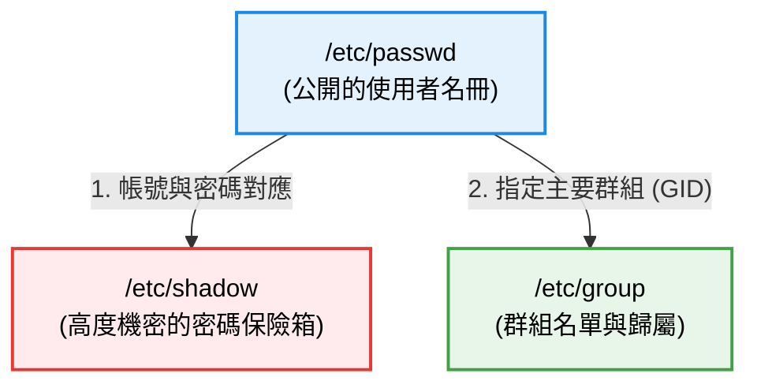

# 帳號與群組管理

### 1. 核心檔案解析 (理論篇)

#### passwd、shadow、group 之間的關係圖

在 Linux 的底層設計中，「帳號與群組」其實就是由這三個純文字檔共同交織而成的資訊網。
很多新手會疑惑，為什麼要把帳號跟密碼分開存放？這其實是基於**資安考量**的絕妙設計！

我們可以用一張關係圖來快速理解它們各自的定位與關聯：



1. **`/etc/passwd`（公開的使用者名冊）**：
   這是系統的「公開名冊」，所有的應用程式都可以讀取它來查詢系統裡有哪些帳號、這個帳號的 ID (UID) 是多少、預設的家目錄在哪裡。但**裡面沒有真正的密碼**。
2. **`/etc/shadow`（機密的密碼保險箱）**：
   因為 `/etc/passwd` 必須讓所有人都能讀取，如果把密碼寫在裡面就太危險了！所以 Linux 將真正的加密密碼與過期政策，獨立抽離到 `/etc/shadow` 中，並且**嚴格限制只有 Root 才有權限讀取**。
3. **`/etc/group`（群組名冊）**：
   用來記錄系統裡有哪些群組（Group），以及每個群組的 ID (GID)。每個使用者在 `/etc/passwd` 裡都會被指定一個「主要群組 GID」，用來跟這裡的資料做綁定與對應。

#### passwd 結構

`/etc/passwd` 是系統中最核心的帳號名冊，每一行代表一個帳號。你可以用前面學過的 `head` 指令來查看第一行：`head -n 1 /etc/passwd`。

你會看到類似這樣用冒號 `:` 隔開的 7 個欄位：
`root:x:0:0:root:/root:/bin/bash`

這 7 個欄位分別代表的意義如下（這是 Linux 維運面試或考證照的必考題）：

1. **帳號名稱 (Account)**：`root`
   使用者登入時輸入的名稱。
2. **密碼佔位符 (Password)**：`x`
   早期的 Linux 真的把密碼寫在這裡，但後來為了資安，這裡統一改成 `x`，代表「真正的密碼已經移交給 `/etc/shadow` 去保管了」。
3. **使用者 ID (UID)**：`0`
   Linux 系統真正在識別使用者的「身分證字號」（系統只認數字不認名字）。
   - `0`：永遠保留給 Root (超級管理員)。
   - `1 ~ 999`：通常保留給系統服務 (例如伺服器程式運作時用的虛擬帳號)。
   - `1000 以上`：一般使用者 (我們用指令建立的新帳號，預設都是從 1000 開始)。
4. **主要群組 ID (GID)**：`0`
   這個帳號所屬的「主要群組」的 ID，用來去對應 `/etc/group` 檔案裡的群組名稱。
5. **備註說明 (GECOS)**：`root`
   這只是一個附屬欄位，通常用來記錄使用者的全名、分機、信箱等，沒有實質作用。
6. **家目錄 (Home Directory)**：`/root`
   使用者登入後，預設會抵達的目錄路徑。
7. **預設 Shell (Default Shell)**：`/bin/bash`
   使用者登入後，系統派發給他的命令列環境（在 Rocky/CentOS 通常是 Bash）。
   _(💡 實務提醒：如果你看到這個欄位寫著 `/sbin/nologin`，代表這個帳號「**被禁止登入終端機**」，這是系統服務帳號常見的安全防護機制。)_

#### shadow 結構

`/etc/shadow` 是系統的「機密保險箱」，只有 Root 才有權限讀取（權限通常是 `000` 或 `400`）。裡面存放了真正的加密密碼，以及密碼的「過期政策」。

你可以用指令查看它（需有 root 權限）：`sudo head -n 1 /etc/shadow`
你會看到類似這樣用冒號 `:` 隔開的 9 個欄位：
`root:$6$xyz...:19500:0:99999:7:::`

這 9 個欄位的意義如下：

1. **帳號名稱**：對應 `/etc/passwd` 的帳號。
2. **加密密碼**：一長串雜湊過後的亂碼（通常以 `$6$` 開頭代表 SHA-512 加密）。如果這個欄位開頭是 `!` 或 `*`，代表該帳號被鎖定或禁止密碼登入。
3. **最後一次修改密碼的日期**：自 1970 年 1 月 1 日以來的「天數」。
4. **密碼不可變更的天數 (Min)**：改完密碼後，至少要等幾天才能再次修改（防禦頻繁改密碼）。設定 `0` 代表隨時可改。
5. **密碼需要重新設定的天數 (Max)**：密碼的有效期限（預設通常是 `99999` 天，約等於 273 年，也就是永遠不過期）。
6. **密碼過期前的警告天數 (Warn)**：到期前幾天系統會開始發出警告（預設通常是 `7` 天）。
7. **密碼過期後的寬限天數 (Inactive)**：密碼過期後，如果過了這個天數都沒改密碼，帳號就會被正式鎖定。
8. **帳號失效日期 (Expire)**：直接指定該帳號在哪一天自動報廢（通常用於約聘人員或臨時帳號，同樣是以 1970 年起算的天數）。
9. **保留欄位**：目前沒有意義，保留給未來功能使用。

#### group 結構

`/etc/group` 記錄了系統內所有的群組資訊。可以透過 `head -n 1 /etc/group` 查看，通常長這樣：
`root:x:0:`

由冒號 `:` 隔開的 4 個欄位：

1. **群組名稱**：`root`
2. **群組密碼佔位符**：`x`（與 passwd 類似，真正的群組密碼被移到了 `/etc/gshadow`，但實務上現代 Linux 極少使用群組密碼）。
3. **群組 ID (GID)**：`0`（用來跟 `/etc/passwd` 的第四個欄位做主要群組對應）。
4. **支援群組的使用者 (Members)**：這個欄位會列出哪些帳號將這個群組作為「次要群組」。如果有多個帳號，會用逗號 `,` 隔開。

:::tip[💡 觀念解析：主要群組 (Primary) vs 次要群組 (Secondary)]
如果把 Linux 系統當作一家「公司」，群組的概念可以用以下比喻來快速理解：

- **主要群組 (Primary Group) 👉 你的「直屬部門」**
  - 在公司裡，每個人**必須且只能有一個**直屬部門。
  - **記錄在哪裡？** 直接寫死在 `/etc/passwd` 的第 4 個欄位 (GID)。
  - **有什麼作用？** 當你在伺服器上建立一份新檔案時，這份檔案的擁有部門預設就會是你的直屬部門。
- **次要群組 (Secondary Group) 👉 你的「跨部門專案組」或「特權通行證」**
  - 除了直屬部門，你可能還兼任了福委會、或是擁有進出機房的權限。一個人可以有**零個或多個**這樣的次要身分。
  - **記錄在哪裡？** 寫在 `/etc/group` 的第 4 個欄位（Members 欄位）。
  - **有什麼作用？** 用來取得額外的特權。

#### 🏢 實戰情境演練：新進工程師 Alice 的報到

今天公司來了一位後端工程師 Alice，身為系統管理員的你會這樣設定她的帳號：

1. **設定主要群組 (直屬部門)**：
   你先建立了一個名為 `backend` 的群組，並將 Alice 的**主要群組**設為 `backend`。
   從此以後，Alice 在伺服器上寫的每一支程式，預設的群組擁有權都會是 `backend`，這讓其他後端同事可以共同編輯這些程式碼。
2. **發派次要群組 (特權通行證)**：
   雖然 Alice 是後端部門，但專案需求讓她需要跨部門的特權。於是你透過 `usermod -aG` 發放了三張通行證給她（將她加入三個**次要群組**）：
   - `docker` 群組：讓她可以直接執行容器指令。
   - `adm` 群組：讓她有權限去讀取 `/var/log` 裡面的系統日誌。
   - `wheel` 群組：讓她擁有 `sudo` 的最高權限。

這就是次要群組最強大的地方：**我們不需要改變 Alice 的直屬部門（她依然是後端工程師），就能靈活地賦予她各種跨部門的特殊權限！**
:::

#### login.defs 設定

`/etc/login.defs` 是系統建立新帳號時的「全域預設政策檔」。
當你執行 `useradd` 指令，但沒有加上任何參數時，系統就是從這個檔案裡去讀取預設值。

裡面常見的關鍵設定包含：

- **`UID_MIN / UID_MAX`**：一般使用者的 UID 範圍（預設從 1000 開始，上限通常是 60000）。這解釋了為什麼你自己建立的帳號 UID 都是一千多起跳。
- **`PASS_MAX_DAYS`**：預設的密碼有效天數（建帳號時，會自動寫入 shadow 的第 5 欄）。
- **`CREATE_HOME`**：預設是否自動建立家目錄（設為 `yes` 時，建立帳號就會同時產生 `/home/username` 目錄）。
- **`UMASK`**：**(極度重要的資安設定)** 決定了新建立帳號時，家目錄的預設權限屏蔽。通常預設是 `077`，這確保了除了帳號本人，其他同事都絕對無法進入或偷看這個目錄的內容。
- **`USERGROUPS_ENAB`**：決定是否要建立「與帳號同名」的專屬群組 (UPG 機制)。如果設為 `yes`，當你建立 `alice` 時，系統會自動建一個叫 `alice` 的主要群組給她；如果設為 `no`，所有新帳號都會被統一丟進系統預設的共同群組（例如 `users`）。
- **`ENCRYPT_METHOD`**：決定密碼要用什麼演算法加密。現代 Linux 預設通常是 `SHA512`，這也就完美解釋了為什麼你在 `/etc/shadow` 看到那串亂碼密碼都是以 `$6$` 開頭！

**【實戰範例：修改全域密碼政策】**
假設公司通過了新的資安稽核規範：「所有新進員工的密碼，每 90 天就必須強制更換一次，且密碼過期前 14 天要提早警告」。
與其每次建立帳號都手動打一堆參數，系統管理員的標準做法是直接去修改 `/etc/login.defs`：

```bash
# 使用 vi 打開 /etc/login.defs 後，找到並修改以下參數：
PASS_MAX_DAYS   90      # 密碼最長有效天數改為 90
PASS_MIN_DAYS   0       # 密碼最短修改間隔
PASS_WARN_AGE   14      # 提早 14 天發出過期警告
```

設定存檔後，未來只要是用 `useradd` 新建立的帳號，都會自動繼承這個「90天強制換密碼」的鐵律，這才是系統管理員該有的自動化思維！

#### skel (預設環境模板)

`/etc/skel`（Skeleton，骨架的意思）是一個非常有趣的**「目錄」**。
_(💡 新手常犯錯誤：因為它長得很像設定檔，很多人會直覺用 `cat /etc/skel` 去看它然後報錯。請記住，查看目錄必須用 `ls`，而且因為裡面的檔案都是以 `.` 開頭的隱藏檔，所以你必須下 **`ls -la /etc/skel`** 才看得到裡面的東西！)_

可以把它想像成發給每一位新帳號的「新手村初始裝備包」。

當你使用 `useradd` 建立一個新帳號並要求產生家目錄時，系統會去把 `/etc/skel` 裡面的**所有檔案與隱藏設定檔**（例如 `.bashrc`, `.bash_profile`），完整複製一份到該使用者的家目錄 `/home/username` 底下。

**【實戰範例：統一配發新人的初始裝備包】**
在企業環境中，我們常希望每位新進工程師的終端機環境能有一致的體驗。假設公司有以下三個規範：

1. 一登入家目錄就必須擁有一個 `projects` 開發資料夾。
2. 終端機預設要配置好 `ll` (等同於 `ls -lah`) 的快捷別名。
3. 預設的 Vim 編輯器必須開啟行號顯示 (`set nu`)。

與其等工程師報到後一個一個去手動設定，系統管理員的標準做法是直接去修改 `/etc/skel` 這個**「模板目錄」**裡面的檔案：
_(💡 觀念澄清：這裡沒有所謂的「開啟模板專屬指令」，因為 `/etc/skel` 就只是一個普通的資料夾！管理員只需要用 `cd /etc/skel` 走進去，然後用 `vi` 去編輯裡面的隱藏檔就可以了。)_

```bash
# 1. 建立預設資料夾 (未來建帳號時，這個資料夾會被連同複製過去)
sudo mkdir /etc/skel/projects

# 2. 修改模板中的 .bashrc，加入快捷別名
sudo vi /etc/skel/.bashrc
# （打開檔案後，在最下面新增一行： alias ll='ls -lah'）

# 3. 在模板中新增 .vimrc，設定 Vim 預設開啟行號
sudo vi /etc/skel/.vimrc
# （打開空白檔案後，寫入一行： set nu）
```

設定完成後，當你執行 `useradd -m bob` 建立新帳號 Bob 時，系統會在背後默默做這三件事：

1. 建立 `/home/bob/` 目錄。
2. 把 `/etc/skel/` 裡的所有東西（包含我們剛放進去的 `projects` 目錄、改過的 `.bashrc`、新建的 `.vimrc`）**一字不漏地完整複製**到 `/home/bob/` 裡面。
3. 將這些複製過去的檔案，擁有權全部自動改為 `bob`。

結果就是：Bob 第一次登入系統時，不用做任何設定，他的家目錄就已經有 `projects` 資料夾，敲下 `ll` 就能用，打開 Vim 也自動顯示行號了！這就是 `/etc/skel` 在自動化維運上的強大威力。

:::caution[⚠️ 新手常踩坑：這跟全域設定有什麼不同？]
很多新手會誤以為把 alias 寫進 `/etc/skel/.bashrc`，全系統的人都會立刻生效，這是一個非常經典的誤解！

- **`/etc/skel` 只是「複製用的母版」**：它**只在帳號建立的那一瞬間**有作用（系統會把裡面的東西 Copy 一份到新帳號的家目錄）。如果某個帳號是昨天建好的，你今天才去改 `/etc/skel`，那個舊帳號是**絕對不會**有 `ll` 可以用的！
- **真正的全域設定 (`/etc/profile` 或 `/etc/bashrc`)**：如果你希望「不管新舊帳號，全公司所有人立刻都能用 `ll`」，那你應該去改 `/etc/bashrc` 這種全域設定檔，而不是改 `/etc/skel` 喔！
- **那會不會改到我自己的 `.bashrc`？**：絕對不會！你自己的設定檔放在你的家目錄（例如 `/home/qiuliwen/.bashrc`），而你剛才編輯的是 `/etc/skel/.bashrc`，這是兩個完全獨立的檔案。你去修改模板，並不會影響到你目前自己正在使用的環境。
  :::

### 2. 帳號與群組操作 (實戰篇)

與其死記硬背每一個指令，不如讓我們跟著日常維運最常見的 4 個實戰任務，把這些指令串連起來！

#### 🕵️‍♂️ 任務零：狀態檢視 (動手前先確認現狀)

在進行任何修改前，我們必須先確認目前的狀態。

1. **`id [帳號名稱]`**：查詢指定帳號的 UID、主要群組 GID，以及隸屬的所有次要群組。
   - 不加帳號名稱時，會顯示「當前登入使用者」的資訊。
   - **實戰範例**：
     ```bash
     $ id alice
     uid=1001(alice) gid=1001(alice) groups=1001(alice),10(wheel),981(docker)
     # (這表示 alice 的主要群組是 alice，但她同時擁有 wheel 和 docker 的次要特權)
     ```
2. **`groups [帳號名稱]`**：單純列出該帳號隸屬的所有群組名稱。
   - **實戰範例**：
     ```bash
     $ groups alice
     alice : alice wheel docker
     ```
3. **`getent` (Get entries)**：用來查詢系統資料庫的萬用指令。
   - `getent passwd`：列出系統所有的使用者清單（比單純 `cat /etc/passwd` 更準確，因為能抓到 LDAP 等網路認證帳號）。
   - **實戰範例**（實務上通常會搭配指定名稱來單獨查詢）：
     ```bash
     $ getent passwd alice
     alice:x:1001:1001::/home/alice:/bin/bash
     # (輸出的格式就跟理論篇教的 /etc/passwd 結構一模一樣！)

     $ getent group wheel
     wheel:x:10:alice,bob
     # (這代表 alice 和 bob 目前都在 wheel 這個擁有 sudo 特權的次要群組內)
     ```

#### 🎒 任務一：新人報到 (Onboarding)

今天公司來了一位新工程師 Alice，你需要幫她把帳號與權限辦妥。這是一套標準的連續技：

1. **建立帳號 (`useradd`)**
   - 常用參數說明：
     - `-m` (make home)：強制建立家目錄，並將 `/etc/skel` 初始裝備包複製進去。
     - `-s /bin/bash` (shell)：指定帳號登入後預設使用的 Shell。
     - _(💡 另外還有 `-g 群組名` 指定主要群組、`-G 群組名` 附加到次要群組)_
   - **實戰範例**：
     ```bash
     $ sudo useradd -m -s /bin/bash alice
     ```
2. **設定初始密碼 (`passwd`)**
   - 說明：Root 強制配發一組臨時密碼。
   - **實戰範例**：
     ```bash
     $ sudo passwd alice
     Changing password for user alice.
     New password:  # 盲打輸入密碼不會顯示字元
     Retype new password:
     passwd: all authentication tokens updated successfully.
     ```
3. **強制重設密碼 (`chage`)**
   - 常用參數說明：
     - `-d 0` (day)：將最後修改密碼的日期設為 0 (亦即 1970/1/1)。
   - 說明：**(極度常用的企業技巧)** 將最後修改日期歸零，這會導致 Alice **下一次登入時，系統就會強制要求她立刻重設密碼**。這是發派新帳號的標準資安起手式！
   - **實戰範例**：
     ```bash
     $ sudo chage -d 0 alice
     # (可用 chage -l alice 來檢查，會看到 "Last password change" 變成 "password must be changed")
     ```

#### 🏢 任務二：建立專屬部門群組 (Group Management)

在 Alice 報到後，公司決定成立一個新的跨部門專案組 `dev_team`，你需要將這個群組建立起來。

1. **建立群組 (`groupadd`)**
   - 說明：建立一個全新的群組。
   - **實戰範例**：
     ```bash
     $ sudo groupadd developers
     ```
2. **修改群組 (`groupmod`)**
   - 常用參數說明：
     - `-n` (new name)：為群組重新命名。
   - 說明：老闆覺得 `developers` 這個名字不好，要求改成 `dev_team`。
   - **實戰範例**：
     ```bash
     $ sudo groupmod -n dev_team developers
     ```
3. **刪除群組 (`groupdel`)**
   - 說明：專案結束後，將這個群組刪除。
   - _(💡 注意：如果這個群組是某個現存使用者的「主要群組」，系統會拒絕刪除，必須先去修改該使用者的設定。)_
   - **實戰範例**：
     ```bash
     $ sudo groupdel dev_team
     ```

#### 🛡️ 任務三：權限擴充與提權 (Privilege Escalation)

Alice 過了試用期，主管要求你發給她 `docker` 操作權限，以及伺服器的最高管理權限 `sudo`。

1. **加入次要群組：發放特權通行證 (`usermod -aG` 或 `gpasswd -a`)**
   - 常用參數說明：
     - `usermod`：`-a` (append) 附加，`-G` (Groups) 次要群組。
     - `gpasswd`：`-a` (add) 加入一位成員。
   - ⚠️ **致命警告**：使用 usermod 時**千萬、絕對、務必記得加上 `-a` (append)**！如果只打 `-G`，系統會把 Alice 從她原本隸屬的其他所有次要群組中踢出，這在企業中是一場災難！
   - **實戰範例**：
     ```bash
     # 做法 A (使用 usermod)：
     $ sudo usermod -aG docker,wheel alice

     # 做法 B (使用 gpasswd，一次只能加一個，但語法直覺，不容易闖禍)：
     $ sudo gpasswd -a alice docker
     Adding user alice to group docker
     ```
2. **編輯 sudo 授權名單 (`visudo`)**
   - 說明：為什麼把 Alice 加入 `wheel` 群組她就有 sudo 權限？因為系統預設的授權名單寫在 `/etc/sudoers` 檔案裡。
   - **實戰範例**：
     ```bash
     $ sudo visudo
     # 絕對不要用 vi 直接編輯這個檔案！visudo 會在存檔前自動檢查語法。
     # 找到這一行，確保沒有被註解掉，這代表 wheel 群組的人都有 sudo 權限：
     %wheel  ALL=(ALL)       ALL
     ```
3. **切換身分測試 (`su`)**
   - 常用參數說明：
     - `-` (login shell)：這代表連同「環境變數與家目錄」一起完全切換，就像該使用者真的從終端機登入一樣。
   - 說明：切換成 Alice 身分測試看看。**(極度重要) 強烈建議加上 `-`**！才不會發生路徑與變數錯亂的問題。
   - **實戰範例**：
     ```bash
     $ su - alice
     [alice@server ~]$ pwd
     /home/alice
     ```
4. **借用 Root 權限執行指令 (`sudo`)**
   - 說明：既然 Alice 已經在 `wheel` 群組裡了，她不需要知道 root 的密碼，只要在任何指令前面加上 `sudo`，並輸入**她自己的密碼**，就能短暫借用特權。
   - **實戰範例**：
     ```bash
     [alice@server ~]$ sudo cat /etc/shadow
     [sudo] password for alice:  # 這裡要輸入 Alice 自己的密碼
     root:$6$xxxxxx...:19000:0:99999:7:::
     # (成功查看到原本只有 root 才能看的系統密碼檔！)
     ```

#### 👋 任務四：員工離職 (Offboarding)

幾年後 Alice 決定離職了，身為管理員，你不能直接把她刪掉，因為她家目錄裡可能還有交接資料！標準的離職流程是這樣的：

1. **鎖定帳號 (`passwd -l`)**
   - 常用參數說明：
     - `-l` (lock)：鎖定帳號。
     - _(💡 相對應的解鎖參數是 `-u` (unlock))_
   - 說明：這會在她的 `/etc/shadow` 密碼前加上驚嘆號 `!`，讓她立刻無法登入，但資料都還在。
   - **實戰範例**：
     ```bash
     $ sudo passwd -l alice
     Locking password for user alice.
     ```
2. **踢出特權群組 (`gpasswd -d`)**
   - 常用參數說明：
     - `-d` (delete)：將成員從群組中刪除。
   - 說明：先將她從 sudo 特權群組中移除，以防萬一。
   - **實戰範例**：
     ```bash
     $ sudo gpasswd -d alice wheel
     Removing user alice from group wheel
     ```
3. **保留資料刪除帳號 (`userdel`)**
   - 常用參數說明：
     - `-r` (remove)：連同家目錄與使用者的信箱一起徹底刪除。
   - 說明：單純 `userdel` 會保留家目錄，實務上常為了保留離職信件與交接資料而這麼做。
   - **實戰範例**：
     ```bash
     $ sudo userdel alice

     # 如果要毀屍滅跡，加上 -r 會連同家目錄一起徹底刪除，請小心使用！
     $ sudo userdel -r alice
     ```

---

### 5. 現代 MIS 實務：權限與群組架構設計 (RBAC + UPG)

在現代雲端主機與 DevOps 時代，Linux 伺服器的定位已從舊時代的「多人共同辦公桌」轉變為「應用服務與軟體執行的隔離平台」。身為企業 MIS 與系統維運工程師，應遵循 **「以職能群組作為角色邊界 (RBAC) + 使用者私有群組 (UPG)」** 的黃金架構來規劃主機權限。

#### 現代 Linux 群組的真實業界定位 (UPG vs 服務隔離)

| 群組分類 | 代表案例 | 業界真實定位與實務原則 |
| :--- | :--- | :--- |
| **真人帳號的主要群組<br />(Primary Group - UPG)** | `amy : amy`<br />`alex : alex` | **身分基本盤與防護隔離**：<br />現代主機上不會把部門（如 `IT`）設為個人的主要群組。保留同名的私有群組 (`amy:amy`) 主要是為了保護其私有家目錄、 `.bash_history` 以及 **`.ssh` 登入金鑰目錄的安全**（防止因為目錄權限開放給同事，遭 sshd 判定危險而拒絕登入）。**實務上我們從不更改別人的主要群組**。 |
| **系統服務的主要群組<br />(Service Accounts)** | `nginx : nginx`<br />`mysql : mysql`<br />`docker : docker` | **應用服務沙盒隔離 (Sandbox & Isolation)**：<br />現代「專屬一對一群組」發揮大威力之處！為 Nginx、MySQL 建立獨佔身分，萬一 Web 服務遭駭客攻破，也能被限制在 `nginx` 的群組牢籠裡，無法跨越邊界去讀寫旁邊 `mysql:mysql` 的資料庫。 |
| **次要群組<br />(Supplementary Groups)** | `sysadmin`<br />`mis_ops`<br />`developers` | **真正的權限控管與職能通行證 (RBAC)**：<br />透過將工程師個人帳號掛載不同「次要群組 (-aG)」，賦予他能執行哪些系統命令、以及參與哪些專案目錄的開發協作。 |

#### 企業 MIS 權限管理核心黃金法則

1. **95% 用「角色 (`%群組`)」，5% 用「單人」**：
   在 `/etc/sudoers` 裡，切勿把 50 個工程師的名字一筆筆寫進去（容易造成管理混亂與離職漏刪漏洞）。應一律以 **`%群組名稱` (角色)** 宣告權限，人員異動時僅需使用 `usermod -aG` 或 `gpasswd -d` 增減次要群組即可。
2. **嚴禁外單位直接加入 `docker` 群組 (等同 Root 提權隱患)**：
   在 Linux 中，把成員加入 `docker` 群組實質上就等於送他 Root 權限。任何 docker 群組成員都可以執行 `docker run -v /:/host -it ubuntu bash`，把主機根目錄 `/` 完整掛進容器中進行任意竄改。

#### 經典 MIS 4 層職能群組與 visudo 白名單示範

在企業實務中，我們會為 MIS / Ops 團隊設定至少 3~4 層的職能白名單：

| 群組名稱 | 賦予對象 | 權限定位與實務原則 |
| :--- | :--- | :--- |
| **`mis_admin`**<br />(或 `wheel`) | MIS 主管、資深 SRE 架構師 | **整台系統最高權限**：具備 `ALL=(ALL:ALL) ALL` 權限；強制必須驗證個人密碼 (`NOPASSWD` 嚴禁開放)。 |
| **`mis_ops`** | 全體 MIS 團隊<br />(含新進工程師 `amy`) | **日常維運白名單**：**無完整 root 權限**！僅開放低風險常規指令（服務重啟 `systemctl`、查看系統狀態 `journalctl`/`df`/`du`/`ps` 等）。 |
| **`developers`** | 應用程式 / 後端開發同仁 | **無系統 sudo 權限**：透過專案資料夾的 `SGID (2775)` 共同協作讀寫，可查看應用層日誌但不可更改系統設定。 |

```bash title="/etc/sudoers.d/enterprise-rbac" showLineNumbers
# 1. 系統最高管理者角色：必輸入密碼
%mis_admin  ALL=(ALL:ALL) ALL

# 2. MIS 日常維運與新人角色：白名單機制 (絕對路徑防護)
%mis_ops    ALL=(ALL) /usr/bin/systemctl restart *, \
                      /usr/bin/systemctl status *, \
                      /usr/bin/journalctl *, \
                      /usr/bin/df *, \
                      /usr/bin/du *

# 3. 嚴格限縮外單位人員 (如 ext_ken) 只有單一特定 Docker 專案的重啟權
ext_ken     ALL=(ALL) NOPASSWD: /usr/bin/docker compose -f /opt/myapp/docker-compose.yml up -d, \
                                /usr/bin/docker restart my-app, \
                                /usr/bin/docker logs --tail=100 my-app
```

:::tip[💡 新人到職與升遷的一鍵無痛 SOP]
- **新人到職 (如 `amy`)**：
  ```bash
  $ sudo useradd -m -s /bin/bash amy         # 自帶 amy:amy 主要群組保護 SSH 隱私
  $ sudo usermod -aG mis_ops amy             # 掛上日常維運次要群組
  ```
- **通過考核晉升為資深管理員**：
  ```bash
  $ sudo usermod -aG mis_admin amy           # 直接多掛最高特權群組，不用改 sudoers！
  ```
- **離職卸除權限**：
  ```bash
  $ sudo gpasswd -d amy mis_admin            # 1 秒移除最高特權
  $ sudo passwd -l amy                       # 立即鎖定登入
  ```
:::

#### 特殊情境：如何安全授權「外單位 Docker 部署任務」？

當外單位同仁需要部署 Docker 服務，又不能給予 `docker` 群組權限時，MIS 最紮實的解決方案是 **「封裝專屬安全部署腳本 + visudo 單條指令授權」**：

1. **MIS 撰寫唯讀的部署腳本 (`/usr/local/bin/deploy-myapp.sh`)**：
   ```bash title="/usr/local/bin/deploy-myapp.sh"
   #!/bin/bash
   cd /opt/myapp && git pull origin main && docker compose up -d --remove-orphans
   ```
2. **用 `visudo` 只開放該隻 Shell Script 的執行權**：
   ```bash title="/etc/sudoers.d/external-deployers"
   ext_ken  ALL=(ALL) NOPASSWD: /usr/local/bin/deploy-myapp.sh
   ```
只要對方嘗試下其他 Docker 指令或想掛載主機根目錄，系統將無條件攔截拒絕，真正達成**「只給予目標任務權限」**的極致安全！
