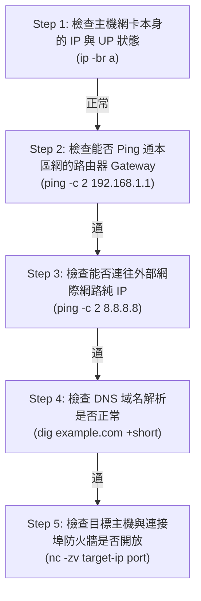

# 網路設定與工具使用

在 Linux 企業伺服器管理與 DevOps 維運現場，網路是所有分散式服務、容器集群與雲端應用的動脈。當 Web 伺服器連不上資料庫、微服務 API 呼叫逾時，或是網站回應緩慢時，能否在第一時間透過指令診斷是「DNS 解析壞掉」、「連接埠防火牆遭到封鎖」、「網卡路由沒寫入」，還是「MTU 封包遭到拋棄」，是區分新手與資深工程師的核心指標。

本篇筆記將從 Linux 現代化網路工具的世代交替出發，詳細講解 `ip`、`ss`、`curl`、`nc`、`dig`、`tcpdump` 等經典診斷利器，並深入探討手動配置固定 IP 的 3 大實務方案、防火牆管理、 5 步網路故障排查 SOP，最後收錄企業機房最常見的 3 大高階架構情境解法。

---

## 現代 Linux 網路工具世代交替 (`net-tools` vs `iproute2`)

在早期的 Linux 中，多數工程師慣用 `ifconfig`、`netstat` 與 `route` 等指令。然而，這個名為 **`net-tools`** 的舊工具包因不支援現代化網路特性（如 Policy Routing、SR-IOV、網路命名空間等），自 CentOS 7 / Ubuntu 18.04 起**已被官方正式宣佈棄用 (Deprecated)**。

現今全系列 Linux 標準安裝自帶的網路指令是 **`iproute2` 工具集**。

| 任務分類 | 舊時代 (`net-tools` - 已停用) | 新時代 (`iproute2` - 現代必備) | 核心優勢與差異說明 |
| :--- | :--- | :--- | :--- |
| **檢視網卡與 IP** | `ifconfig` | **`ip a`** (`ip addr show`) | `ip a` 支援單卡多 IP (Alias/Secondary IP) 與虛擬網路卡資訊 |
| **啟用/關閉網卡** | `ifconfig eth0 up/down` | **`ip link set eth0 up/down`** | 語法結構標準化，支援容器 Bridge 網路操作 |
| **檢視路由表 (Gateway)** | `route -n` | **`ip r`** (`ip route show`) | 顯示最詳細的 Policy Routing 規則與優先序 |
| **查詢監聽通訊埠 (Port)** | `netstat -tulnp` | **`ss -tulnp`** | `ss` 直接從核心 Linux eBPF/TCP_DIAG 讀取，速度快數百倍 |
| **查詢 ARP 區網對照表** | `arp -a` | **`ip neigh`** | 能完整呈現 IPv4 (ARP) 與 IPv6 (NDP) 的鄰居發現表 |

:::info[💡 為什麼要強迫自己改用 `iproute2`？]
許多在舊版 CentOS 6 養成習慣的工程師仍習慣輸入 `ifconfig`，但在現代精簡版的容器 Base Image (如 `alpine`, `ubuntu:22.04`) 中，預設完全沒有安裝 `ifconfig`。熟悉 `ip` 與 `ss` 指令，才能在任何現代 Linux 伺服器與 K8s Pod 中順利除錯。
:::

---

## 1. ip：全能網路管理與路由檢視

`ip` 是 Linux 現代化網路指令的核心骨幹。只要熟記 `ip` 與其後綴參數，就能掌控主機所有網卡與路由狀態。

### 檢視網路介面與 IP 地址 (`ip addr` / `ip a`)

```bash showLineNumbers
# 1. 檢視所有網卡資訊
$ ip a

# 2. 🌟 實戰排錯必備：以極簡列表顯示卡號、狀態 (UP/DOWN) 與 IP (`-br` = brief)
$ ip -br a
lo               UNKNOWN        127.0.0.1/8 ::1/128
eth0             UP             192.168.1.100/24 fe80::100/64
docker0          DOWN           172.17.0.1/16

# 3. 臨時在 eth0 網卡增加一組備用 IP
$ sudo ip addr add 192.168.1.200/24 dev eth0
```

### 檢視與操作路由表 (`ip route` / `ip r`)

當主機無法上網或封包無法傳抵另一個網段時，第一步請檢查 **預設閘道 (Default Gateway)**：

```bash showLineNumbers
$ ip r
default via 192.168.1.1 dev eth0 proto dhcp metric 100
192.168.1.0/24 dev eth0 proto kernel scope link src 192.168.1.100 metric 100
172.17.0.0/16 dev docker0 proto kernel scope link src 172.17.0.1 linkdown
```

- **解讀關鍵**：看到 `default via 192.168.1.1` 代表整台伺服器對外通聯都是透過 `192.168.1.1` 這台路由器出海。

---

## 2. ss：查詢連接埠監聽與服務對照 (取代 netstat)

**`ss` (Socket Statistics)** 是系統工程師與 MIS 每天用到次數最多的連接埠 (Port) 診斷工具。

```bash showLineNumbers
# 🌟 每日精選「黃金 5 參數組合」：查詢系統中正在聽 (Listen) 哪些 Port
$ sudo ss -tulnp
State   Recv-Q  Send-Q   Local Address:Port      Peer Address:Port  Process
LISTEN  0       511          127.0.0.1:3306           0.0.0.0:*      users:(("mysqld",pid=1234,fd=21))
LISTEN  0       511            0.0.0.0:80             0.0.0.0:*      users:(("nginx",pid=2345,fd=6))
LISTEN  0       4096     192.168.1.100:6443           0.0.0.0:*      users:(("kube-apiserver",pid=4567,fd=7))
```

- **「黃金參數 `tulnp`」完整拆解**：
  - `-t` (TCP)：只顯示 TCP 協定的 Socket。
  - `-u` (UDP)：只顯示 UDP 協定的 Socket。
  - `-l` (Listening)：只過濾出狀態為「正在監聽中」的服務。
  - `-n` (Numeric)：**不將 IP 與 Port 解析為名稱**（強制顯示 `:80` 而非 `:http`；顯示 `:22` 而非 `:ssh`，解析速度極快）。
  - `-p` (Process)：顯示是由哪一個具體程式與 PID 佔據此 Port（**務必加 `sudo` 權限**才能查看別人的 Process）。

:::tip[💡 實戰排錯：Nginx 啟動跳錯 `Address already in use: 80` 怎麼辦？]
代表 Port 80 已經被其他軟體 (例如 Apache 或舊的 Docker 容器) 佔用了！用這行命令秒殺元兇：
```bash
$ sudo ss -tulnp | grep :80
# 查出 PID 號碼後，用 sudo kill -9 <PID> 結束該服務，Nginx 即可順利重啟！
```
:::

---

## 3. curl：API 測試、網頁連通與 HTTP 除錯

對於全端與後端工程師而言，`curl` (Client URL) 已經不再只是簡單的下載網頁指令，而是**在 CLI 測試 RESTful API、偵錯 HTTPS 憑證交握、檢查 CDN 狀態碼**的核心瑞士軍刀！

```bash showLineNumbers
# 1. 測試網站回應的 HTTP Header 狀態碼 (-I 僅取得標頭)
$ curl -I https://example.com
HTTP/2 200
content-type: text/html; charset=UTF-8
server: nginx

# 2. 跟隨 301/302 重新導向，並顯示完整的交握與 SSL 憑證資訊 (-L 跟隨導向, -v 詳細除錯)
$ curl -Lv https://example.com

# 3. 🌟 健康檢查監控腳本神技：只抓取純 HTTP 狀態碼 (例如回應 200, 404, 500)
$ curl -s -o /dev/null -w "%{http_code}\n" https://example.com
200

# 4. 在 Linux 上直接送出 JSON 資料測試後端 API (POST 請求)
$ curl -X POST https://api.example.com/v1/login \
     -H "Content-Type: application/json" \
     -d '{"username":"amy", "password":"123"}'
```

---

## 4. nc (Netcat)：測試遠端連接埠與防火牆開通狀況

很多時候你在 Linux 伺服器上下 `ping database.example.com` 有反應，但應用程式就是報錯連不上資料庫。這時候不能依賴 `ping`，因為**防火牆能允許 Ping (ICMP)，卻可能把資料庫的 TCP 3306 Port 封鎖掉！**

測試特定 IP 的特定 Port 通不通，最強神器是 **`nc` (Netcat)**：

```bash showLineNumbers
# 測試 192.168.1.50 的 MySQL 3306 埠是否暢通 (-z 掃描不傳資料, -v 顯示詳細資訊, -w 設定逾時秒數)
$ nc -zv -w 3 192.168.1.50 3306
Connection to 192.168.1.50 3306 port [tcp/mysql] succeeded!    # 代表防火牆有通、服務存在

# 如果遭到防火牆封鎖或服務沒啟動：
$ nc -zv -w 3 192.168.1.50 3306
nc: connect to 192.168.1.50 port 3306 (tcp) failed: Connection refused
```

---

## 5. dig、nslookup 與 host：DNS 解析診斷

當你的系統在 Terminal 輸入網址時跑了半天跳錯 `Temporary failure in name resolution`，請立刻使用 **`dig` (Domain Information Groper)** 檢查 DNS 是否損毀：

```bash showLineNumbers
# 1. 查詢網址對應的 A 紀錄與解析耗時
$ dig example.com

# 2. 🌟 極簡輸出模式 (+short)：只回傳解析出的純 IP 字串
$ dig example.com +short
93.184.216.34

# 3. 指定特定的 DNS 伺服器 (如 Google 8.8.8.8 或 Cloudflare 1.1.1.1) 進行查證
$ dig @8.8.8.8 example.com +short

# 4. host：最單純快速的 DNS 查驗工具
$ host google.com
google.com has address 142.250.190.46
```

---

## 6. ping、traceroute 與 mtr：連通性與跳點追蹤

除了檢查連接埠與 DNS，在檢驗基礎網路穩定度與線路跳點時，需熟練以下三款工具：

- **`ping` (測試 ICMP 封包與遺漏率)**：
  ```bash
  # Linux 預設會持續 Ping 不會停止，建議務必加 -c 指定發送次數
  $ ping -c 4 8.8.8.8
  ```
- **`traceroute` / `mtr` (追蹤封包經過的每一個路由器跳點 Hop)**：
  ```bash
  # 當跨國連線或專線特別卡頓時，用 traceroute 找出封包是在哪一站台被延遲或丟棄
  $ traceroute google.com

  # 🌟 強烈推薦進階神技 mtr (My Traceroute)：結合 ping 與 traceroute 的即時動態報表
  $ mtr -r -c 10 google.com
  ```

---

## 7. 本機防火牆管理與連接埠開通 (`ufw` / `firewalld`)

前述使用 `nc -zv` 可以測試目標伺服器的連接埠。相反地，當你身為 Linux 伺服器管理者，開發團隊反饋「外部連不上這台主機的 80 / 3306 埠」時，必須掌握如何在主機內部檢查與開通防火牆：

### 1. Ubuntu / Debian 陣營 (`ufw` - Uncomplicated Firewall)

```bash showLineNumbers
# 1. 查看防火牆狀態與已放行的規則清單
$ sudo ufw status verbose

# 2. 開放 HTTP (80) 與 MySQL (3306) TCP 連接埠
$ sudo ufw allow 80/tcp
$ sudo ufw allow 3306/tcp

# 3. 限制只允許特定區網 IP (例如 MIS 辦公室 192.168.1.50) 連入 SSH 22 埠
$ sudo ufw allow from 192.168.1.50 to any port 22 proto tcp

# 4. 重新載入防火牆規則
$ sudo ufw reload
```

### 2. RedHat / Rocky / CentOS 陣營 (`firewalld` / `firewall-cmd`)

```bash showLineNumbers
# 1. 列出目前預設區域 (public) 所有已開放的 Port
$ sudo firewall-cmd --list-ports

# 2. 永久開放 HTTP (80) 與 HTTPS (443) 連接埠 (--permanent 代表寫入設定檔，重新開機不丟失)
$ sudo firewall-cmd --permanent --add-port=80/tcp
$ sudo firewall-cmd --permanent --add-port=443/tcp

# 3. 關鍵步驟：重新載入防火牆設定才會立刻生效
$ sudo firewall-cmd --reload
```

---

## 8. 網路頻寬監控與抓包分析 (`tcpdump` / `iftop`)

當遇到「網路速度突然變慢，懷疑有程式在上傳大量資料」或「合作夥伴說有發送 Webhook API 請求，但我們的程式沒反應，想驗證封包到底有沒有到達伺服器」時，就需要動用封包分析神器：

- **`tcpdump` (命令行抓包神器 / Linux 版 Wireshark)**：
  ```bash showLineNumbers
  # 🌟 經典抓包範例：監聽 eth0 網卡進出 Port 80 的前 100 個 TCP 封包
  # (-nn 不解析 IP 與 Port 名稱；-s0 抓取完整封包內容；-c 指定抓取數量)
  $ sudo tcpdump -i eth0 -nn -s0 -c 100 port 80

  # 只監聽來自特定 IP (192.168.1.50) 傳給主機 Port 8080 的封包
  $ sudo tcpdump -i eth0 src 192.168.1.50 and port 8080 -nn
  ```
- **`iftop` / `nload` (即時終端頻寬流量排行榜)**：
  ```bash
  # nload：以動態波形圖視覺化觀看當前網卡的上傳 (Outgoing) 與下載 (Incoming) 總頻寬
  $ nload -u m eth0

  # iftop：類似 top，列出主機當前和「哪些外部 IP」進行資料傳輸，以及各自佔用多少頻寬
  $ sudo iftop -n -i eth0
  ```

---

## 9. Linux 手動設定固定 IP：臨時測試 vs 永久生效 (3 大實務方案)

在 Linux 管理現場，「手動設定 IP」區分為**「即時生效但重新開機失效（臨時維修/測試/救援）」**與**「手動編輯設定檔永久生效（伺服器固定 IP）」**兩種情境：

### 方案 A：純指令臨時手動配置 (`ip` + `/etc/resolv.conf` —— 救援與測試專用)

當伺服器開機進入單人救援模式、網路卡沒有啟動，或是在純文字最小化環境中需要手動給網卡連網時，請依照下列 4 步驟完全手動指令操作：

```bash showLineNumbers
# 步驟 1：手動綁定 IP 與子網域遮罩至 eth0 網卡
$ sudo ip addr add 192.168.1.150/24 dev eth0

# 步驟 2：手動開啟網卡狀態
$ sudo ip link set eth0 up

# 步驟 3：手動增加預設閘道 (Gateway)，讓封包能走出路由器
$ sudo ip route add default via 192.168.1.1

# 步驟 4：手動設定 DNS 伺服器 (將 DNS 寫入 /etc/resolv.conf)
$ echo "nameserver 8.8.8.8" | sudo tee /etc/resolv.conf
```

- **適用情境**：即時驗證網路連通、現場搶修主機。**重新開機或重啟服務後此設定會自動清空**。

---

### 方案 B：RedHat / Rocky / CentOS 陣營 (手動配置固定 IP)

在 RedHat 系 Linux 中，手動設定永久 IP 可以透過 **「現代命令行 `nmcli`」**、**「文字選單介面 `nmtui`」** 或 **「手動編輯傳統 ifcfg 設定檔」**：

1. **現代化標準做法 (`nmcli` 命令列配置)**：
   ```bash showLineNumbers
   # 將 IP 派發模式從 auto (DHCP) 手動改為 manual (固定 IP)
   $ sudo nmcli connection modify eth0 \
          ipv4.addresses "192.168.1.100/24" \
          ipv4.gateway "192.168.1.1" \
          ipv4.dns "8.8.8.8,1.1.1.1" \
          ipv4.method manual

   # 重新啟動網卡配置使永久設定生效
   $ sudo nmcli connection up eth0
   ```
2. **文字介面選單 (`nmtui`)**：
   直接在命令列執行 `nmtui`，系統會跳出基於 Terminal 的**藍底選單文字介面 (TUI)**，讓你用方向鍵與 Enter 輕鬆修改 IP 配置。
3. **傳統老系統做法 (手動修改 `/etc/sysconfig/network-scripts/ifcfg-eth0`)**：
   在早期的 CentOS 7 或某些舊版企業主機中，工程師習慣手動使用 `vim` 編輯網卡設定檔：
   ```ini title="/etc/sysconfig/network-scripts/ifcfg-eth0" showLineNumbers
   TYPE=Ethernet
   BOOTPROTO=static        # 關鍵：將 dhcp 修改為 static
   NAME=eth0
   DEVICE=eth0
   ONBOOT=yes              # 關鍵：開機自動啟動
   IPADDR=192.168.1.100    # 手動指定 IP
   PREFIX=24               # 子網路遮罩
   GATEWAY=192.168.1.1     # 預設閘道
   DNS1=8.8.8.8            # 主要 DNS
   DNS2=1.1.1.1            # 備用 DNS
   ```
   修改儲存後，執行 `$ sudo systemctl restart network` (舊版) 或 `$ sudo nmcli connection up eth0` 載入設定。

---

### 方案 C：Ubuntu / Debian 陣營 (`Netplan` 手動撰寫 YAML 設定檔)

Ubuntu 自 18.04 起不再採用 `/etc/network/interfaces`，改為使用結構化的 **Netplan (`/etc/netplan/*.yaml`)**：

```yaml title="/etc/netplan/01-netcfg.yaml" showLineNumbers
network:
  version: 2
  renderer: networkd
  ethernets:
    eth0:
      dhcp4: no            # 關鍵：關閉 DHCP 自動派發
      addresses:
        - 192.168.1.100/24 # 手動指定固定 IP
      routes:
        - to: default
          via: 192.168.1.1 # 手動指定預設閘道
      nameservers:
        addresses: [8.8.8.8, 1.1.1.1] # DNS 伺服器
```

設定完 YAML 檔案後，執行驗證與套用：

```bash showLineNumbers
# 1. 安全測試 (60 秒內沒按下 Confirm 會自動回復舊配置，避免遠端手動改 IP 掉線卡死！)
$ sudo netplan try

# 2. 直接正式套用生效
$ sudo netplan apply
```

---

## 10. 網路排障實戰 5 步 SOP (由內而外的連線診斷心法)

當在生產主機遇到任何「連不上網路 / 呼叫不到外部服務」的問題時，請嚴格按照這 **5 個階梯層次（由主機自身往外推）** 進行排查，嚴禁跳階瞎猜：



1. **第一步：看主機自己有沒網卡與 IP (`ip -br a`)**
   - 檢查網卡狀態是 `UP` 還是 `DOWN`？是不是網路卡被停用或網線沒插好？
2. **第二步：看能不能走到家門口 (`ping -c 2 <預設閘道IP>`)**
   - 測試能不能連向路由器 (如 `192.168.1.1`)。若連網關都 Ping 不通，代表本機網線、Switch 交換器或 VLAN 標籤有異常。
3. **第三步：看能不能走出網際網路 (`ping -c 2 8.8.8.8`)**
   - 測試直接連 Google 的純 IP。如果成功，代表主機的路由表 (`ip route`) 與防火牆出站 (Egress) 正常；若失敗，檢查路由器的 NAT / 防火牆規則。
4. **第四步：看是不是 DNS 解析毀了 (`dig google.com`)**
   - 往往發生 **「Ping 8.8.8.8 會通，但打開 curl google.com 就當掉」**，這 100% 是 `/etc/resolv.conf` 裡寫的 DNS 伺服器掛掉或沒權限！
5. **第五步：看目標服務的連接埠是不是活著 (`nc -zv <對方IP> <對方Port>`)**
   - IP 跟 DNS 都沒問題，最後就看遠端 MySQL/Web 伺服器上的 3306/80 Port 有沒有被 Security Group (安全組) 或 `iptables`/`ufw` 防火牆阻擋。

---

## 11. 企業網路維運三大高階實戰情境 (MIS / DevOps 經驗談)

### 情境一：雙網卡 (Dual NICs) 路由衝突 —— 「一台主機永遠只能有一個預設閘道」
- **狀況描述**：資料庫伺服器配置了兩張網卡，`eth0` 連向公網 (`1.1.1.0/24`)，`eth1` 連向內部辦公網 (`10.0.0.0/8`)。工程師分別在兩張網卡設定了各自的 `GATEWAY`，結果伺服器出現隨機斷網、SSH 連不上的災難！
- **根因與解決金律**：
  - 在 Linux 系統中，**「預設閘道 (Default Gateway)」代表全體封包不知道往哪走時的唯一直流出海口，整台伺服器只能設置一組 default via！**
  - **正確作法**：把 `GATEWAY` 只寫在連往公網的 `eth0` 設定中；針對內網的 `eth1` **只設定固定 IP，切勿設定預設閘道**。欲讓主機往內部路由時，改用靜態路由規則：
    ```bash
    # 告訴系統：要前往 10.x.x.x 網段的封包，一律透過 eth1 的內網路由器轉發
    $ sudo ip route add 10.0.0.0/8 via 10.0.0.1 dev eth1
    ```

### 情境二：能正常 Ping 通與 DNS 解析，但下載 Docker Image 或 NPM 套件極度緩慢甚至中斷？
- **狀況描述**：使用 `curl` 小網頁正常，但只要傳送大型檔案或執行 `docker pull` 就會卡住或無回應。
- **根因與解決金律**：
  - 這 95% 是因為 **MTU (Maximum Transmission Unit，最大傳輸單元)** 在雲端專線、PPPoE 或 VPN 隧道中被限縮，導致標準 1500 Bytes 封包遭路由器拋棄。
  - **診斷神技**：使用 `ping -M do` (禁止分段) 逐步調整大小測試：
    ```bash
    # 測試傳送大小 1472 (1472 + 28 ICMP 標頭 = 1500 MTU)，若出現 "Message too long" 代表 MTU 設太大了
    $ ping -c 2 -M do -s 1472 google.com
    ```
  - **解決方式**：使用 `ip link set dev eth0 mtu 1420` 或在其 NetworkManager / Netplan 設定中將 MTU 手動調降至適合 VPN/連線環境的數值 (如 `1420` 或 `1400`)。

### 情境三：高併發 API 伺服器報錯 `Cannot assign requested address`
- **狀況描述**：電商促銷活動或壓力測試期間，後端 API 主機一直報錯，無法再連線到下游的 MySQL DB。
- **根因與解決金律**：
  - 是系統 **本地臨時連線埠 (Ephemeral Ports) 或 `TIME_WAIT` Socket 被徹底耗盡**。
  - **排查命令**：執行 `$ ss -s` 查看統計資訊，若發現 `TCP: ... (timewait xxxxx)` 的數值飆高超過數萬，即為此症狀。
  - **系統調優 (`sysctl`)**：編輯 `/etc/sysctl.conf` 開啟 `tcp_tw_reuse` 釋放重用與擴大本地連接埠範圍：
    ```ini
    net.ipv4.tcp_tw_reuse = 1
    net.ipv4.ip_local_port_range = 1024 65535
    ```
    寫入後執行 `$ sudo sysctl -p` 即可立即釋放並承載萬級並發。
