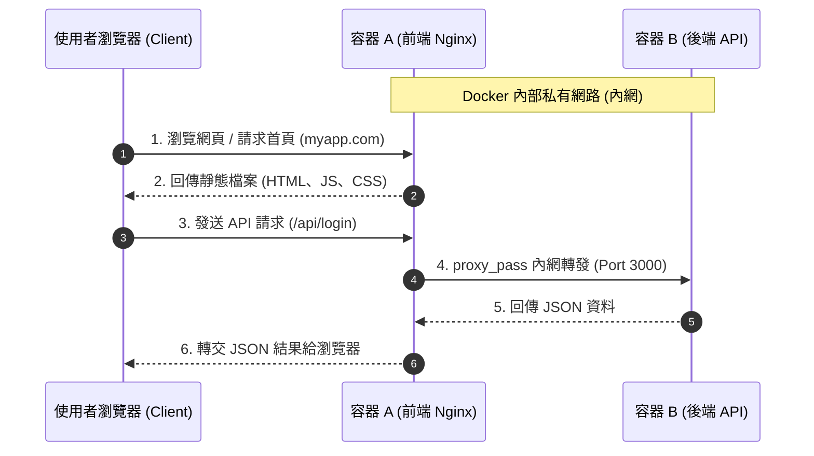

import Head from '@docusaurus/Head';

<Head>
  <script type="application/ld+json">
    {`
      {
        "@context": "https://schema.org",
        "@type": "Article",
        "headline": "Nginx 靜態網站部署實戰",
        "datePublished": "2026-07-08T13:51:33.494Z",
        "author": [{
            "@type": "Person",
            "name": "liwen"
        }],
        "description": "Nginx 靜態網站部署實戰 本章節將帶您進入 Nginx 的第一個核心實戰應用：靜態網站部署。我們將深入探討如何設定網頁根目錄與首頁檔案，分析 root 與 alias 的拼接規則與新手常踩的 Root 陷阱。此外，亦針對 React, Vue 或 Docusaurus 等前端單頁應用程式（SPA..."
      }
    `}
  </script>
</Head>


# Nginx 靜態網站部署實戰

本章節將帶您進入 Nginx 的第一個核心實戰應用：靜態網站部署。我們將深入探討如何設定網頁根目錄與首頁檔案，分析 `root` 與 `alias` 的拼接規則與新手常踩的 Root 陷阱。此外，亦針對 React, Vue 或 Docusaurus 等前端單頁應用程式（SPA）在部署時最常遇到的「重新整理 404 錯誤」，提供詳盡的 `try_files` 原理解析與 Next.js 的部署抉擇。

---

## 1. 託管靜態檔案 (Hosting Static Files)

Nginx 作為靜態網站伺服器時，它的角色就像是**「自動販賣機」**。客人（瀏覽器）投幣按鈕（發送網址請求），Nginx 就會直接去主機硬碟的特定資料夾（根目錄）尋找對應的檔案並遞給客人。

:::note[💡 新手常見疑惑：我可以把我的前端專案直接放在 Nginx 裡面嗎？]

- **答案是：可以，但放的是「打包後的成品」，而不是「原始碼」！**
- **工廠與販賣機的比喻**：
  - 你平時寫的 React/Vue 專案（帶有 `src/`、`node_modules`）是**「飲料研發工廠」**。Nginx 這台自動販賣機看不懂也無法執行這些原始碼。
  - 你需要在本地端執行 `npm run build`，將其包裝壓縮成一罐罐做好的罐裝飲料 —— 這就是編譯出來的 **`dist` (或 `build`) 資料夾**（裡面只有乾淨的 `index.html` 與打包後的 `js/css`）。
  - 你只需要把這個 `dist` 成品資料夾搬到伺服器的硬碟裡，然後讓 Nginx 的 `root` 指向它即可。Nginx 本質上只是一個高效率的「檔案搬運工」，不負責編譯或運行 Node.js 原始碼！

:::

這個過程主要由兩個核心指令控制：`root` 與 `index`。

```nginx
server {
    listen 80;
    server_name myapp.com;

    location / {
        root /var/www/myapp/dist;
        index index.html index.htm;
    }
}
```

### 🔍 詳解核心指令

- **`root` (網頁根目錄) ➡️ 「倉庫的實體地址」**：
  - 告訴 Nginx，當請求進來時，應該去哪一個硬碟路徑（資料夾）裡尋找網頁檔案。
  - _重要細節_：Nginx 會把 **`Location 路由路徑`** 拼接到 **`root 路徑`** 的後面。
    - 範例：當用戶請求 `http://myapp.com/images/logo.png` 時，Nginx 實際尋找的硬碟路徑為：`/var/www/myapp/dist` + `/images/logo.png`。
- **`index` (預設首頁) ➡️ 「預設出貨商品」**：
  - 當用戶訪問的網址是一個**資料夾路徑**而非具體檔案時（例如只輸入域名 `http://myapp.com/`，後面沒有指定任何檔名），Nginx 會依序在該目錄下尋找 `index` 指令所設定的檔案。
  - 如果在資料夾中找到了 `index.html`，就直接將其內容回傳給瀏覽器；如果沒有，則會繼續尋找下一個備用檔（如 `index.htm`）。

:::warning[⚠️ 新手必踩：Root 拼接陷阱 vs Alias 別名]

很多新手在設定特定的子目錄路由（例如 `/admin/`）時，常會分不清 `root` 與 `alias` 的差別，因而導致 `404 Not Found`：

- **`root` ➡️ 「把網址路徑貼在屁股後面」 (預設行為)**

  ```nginx
  location /admin/ {
      root /var/www/myapp/dist;
      index index.html;
  }
  ```

  - **實際尋找路徑**：`/var/www/myapp/dist/admin/index.html`（Nginx 會把 `/admin/` 拼接到 root 目錄後面，去尋找名為 `admin` 的子資料夾）。

- **`alias` ➡️ 「把網址路徑整段換掉」**

  ```nginx
  location /admin/ {
      alias /var/www/myapp/dist/; # 結尾的斜線是必須的！
      index index.html;
  }
  ```

  - **實際尋找路徑**：`/var/www/myapp/dist/index.html`（Nginx 會直接把 `/admin/` 替換成 `/var/www/myapp/dist/`，常用於路由名稱與實際資料夾名稱不一致的場景）。

:::

#### 💡 實務進階：Root 的繼承、覆寫與多專案託管

在實務部署中，我們通常不會在每個 `location` 裡面重複寫一樣的 `root`，而是利用**繼承與局部覆寫**的機制來簡化設定：

##### 1. 預設繼承 (Server 層級 root)

通常會把 `root` 寫在 `server` 區塊中，底下所有的 `location` 都會自動繼承它。

```nginx
server {
    root /var/www/my-blog/dist;

    # 繼承 root，實際尋找：/var/www/my-blog/dist/index.html
    location / {
        index index.html;
    }

    # 繼承 root，實際尋找：/var/www/my-blog/dist/abc/index.html
    location /abc {
        index index.html;
    }
}
```

##### 2. 局部覆寫 (多專案/多資料夾託管)

若在同一個網域下，有不同的網址需要去伺服器硬碟中「完全不同的資料夾」拿檔案，我們就可以在特定的 `location` 中寫一個新的 `root` 來覆寫它。

- **場景**：同一個網域下，主頁 `/` 指向「部落格專案」，後台 `/admin/` 指向「管理系統專案」（兩者為獨立建置、獨立存放的資料夾）。
- **設定**：

  ```nginx
  server {
      listen 80;
      server_name myapp.com;

      # 預設倉庫：部落格專案
      root /var/www/my-blog/dist;

      location / {
          index index.html;
      }

      # 覆寫倉庫：指向後台管理系統的獨立資料夾
      location /admin/ {
          root /var/www/my-admin/dist;
          index index.html;
      }
  }
  ```

  - **結果**：訪問 `http://myapp.com/admin/` 時，Nginx 會因為 `/admin/` 區塊內的 `root` 覆寫，自動跑去硬碟的 `/var/www/my-admin/dist/admin/` 目錄下尋找首頁，而不會去部落格的目錄。

---

## 2. SPA (單頁應用) 路由問題與解決方案

如果您部署的是 React (React Router)、Vue (Vue Router) 或任何現代單頁應用（SPA）網站，在部署到 Nginx 後，您通常會遇到一個非常詭異的災情：

> **「從首頁點擊按鈕跳轉到 `/about` 都很正常，但只要在 `/about` 頁面重新整理（F5），就會立刻噴出 `404 Not Found`！」**

### ❓ 為什麼會這樣？（前端路由 vs 後端路由）

1.  **點擊跳轉沒問題（前端路由操控）**：
    當您在首頁點擊導覽列跳轉時，實際上瀏覽器**完全沒有向 Nginx 發送新的網頁請求**。是前端 JavaScript 程式碼攔截了點擊事件，利用 HTML5 History API 默默改變了瀏覽器網址列的網址，並在畫面上動態抽換組件。這時 Nginx 對這一切毫不知情。
2.  **重新整理噴 404（後端路由操控）**：
    當您按下重新整理（F5）或直接輸入網址 `http://myapp.com/about` 時，瀏覽器會**實打實地向 Nginx 發送一個請求**，表示：「我要拿 `/about` 這個檔案。」
    這時 Nginx（自動販賣機）會很老實地去硬碟倉庫的 `/var/www/myapp/dist/about` 路徑尋找有沒有叫作 `about` 的檔案。因為 SPA 網站本質上**只有一個 `index.html` 實體檔案**，硬碟上根本沒有這個檔案，找不到就只能回傳 `404 Not Found`。

---

### 🛠️ 終極解決方案：`try_files` 指令

為了解決這個問題，我們必須告訴 Nginx：**「如果客人在硬碟找不到實體檔案，不要直接拒絕他，一律把球丟回給 `index.html`，讓前端的 JavaScript 路由來接手！」**

```nginx
server {
    listen 80;
    server_name myapp.com;

    location / {
        root /var/www/myapp/dist;
        index index.html index.htm;

        # 關鍵指令：SPA 的救星
        try_files $uri $uri/ /index.html;
    }
}
```

:::info[💡 try_files 指令的內部三步驟運作原理與實境模擬]

假設伺服器硬碟中的檔案結構如下：

```text
/var/www/myapp/dist/ (根目錄)
├── logo.png           # 實體圖片檔案
├── images/            # 實體資料夾
│   └── index.html     # 資料夾內部預設首頁
└── index.html         # 專案首頁 (SPA 入口檔)
```

設定指令：`try_files $uri $uri/ /index.html;`

當不同請求進來時，Nginx 的變數替換與檢查流程如下：

1.  **情境一：訪問 `myapp.com/logo.png` (請求實體檔案)**
    - **變數 `$uri` 值**：`/logo.png`
    - **第一關 `$uri` 檢查**：實體路徑為 `/var/www/myapp/dist/logo.png`。
    - **判斷與結果**：硬碟中存在此實體檔案。Nginx 直接回傳 `logo.png`，**任務結束（不繼續往下跑）**。
2.  **情境二：訪問 `myapp.com/images/` (請求實體資料夾)**
    - **變數 `$uri` 值**：`/images/`
    - **第一關 `$uri` 檢查**：實體路徑為 `/var/www/myapp/dist/images/`。因為是資料夾，判定「不是實體檔案」，第一關失敗。
    - **第二關 `$uri/` 檢查**：實體路徑為 `/var/www/myapp/dist/images/`。
    - **判斷與結果**：硬碟中存在此實體資料夾。Nginx 配合 `index` 指令，回傳該資料夾底下的 `/var/www/myapp/dist/images/index.html`。**任務結束**。
3.  **情境三：訪問 `myapp.com/about` (請求前端路由，硬碟中無此檔案)**
    - **變數 `$uri` 值**：`/about`
    - **第一關 `$uri` 檢查**：檢查 `/var/www/myapp/dist/about` 檔案。不存在，第一關失敗。
    - **第二關 `$uri/` 檢查**：檢查 `/var/www/myapp/dist/about/` 資料夾。不存在，第二關失敗。
    - **第三關 `/index.html` (最後防線)**：前兩關均失敗，Nginx 直接讀取並回傳最外層的實體首頁檔 `/var/www/myapp/dist/index.html` 給瀏覽器。
    - **瀏覽器端接手**：瀏覽器拿到 `index.html` 後執行 React/Vue 程式碼，前端路由讀取網址列的 `/about`，在瀏覽器端渲染出 `<About />` 組件。用戶完全不會察覺伺服器內部經歷了 Fallback。

:::

:::warning[⚠️ try_files 與 CSS/JS 遺失的 MIME Type 警報]

當您設定了 `try_files $uri $uri/ /index.html;` 後，若瀏覽器請求一個**不存在的 CSS 或 JS 檔案**（例如 `/assets/not-exist.css`）：

1.  因為硬碟找不到該 CSS 檔案，前兩關失敗，Nginx 會在第三關回傳 `index.html` 的 HTML 內容。
2.  瀏覽器本來預期要解析 CSS 樣式，卻收到了 `<html>...</html>` 網頁原始碼，就會在 F12 主控台噴出 MIME 類型不符的報錯：
    `"Resource interpreted as Stylesheet but transferred with MIME type text/html"`
    這是在排查靜態資源遺失時非常關鍵的線索！

:::

#### 🌐 Next.js 的部署抉擇：Static Export vs SSR

現代 React 框架 Next.js 的部署邏輯與一般 SPA 有所不同，主要分為兩種部署模式：

##### 1. 靜態匯出模式 (Static HTML Export)

- **概念**：在 `next.config.js` 設定 `output: 'export'`，Next.js 會在建置時為每個路由產生實體 HTML 檔案（如 `/about.html` 或 `/about/index.html`）。
- **Nginx 設定**：此模式下依然是靜態託管，但因為檔案有 `.html` 後綴，`try_files` 需調整為：
  ```nginx
  location / {
      root /var/www/myapp/out;
      try_files $uri $uri.html $uri/ =404; # 找不到則嘗試補上 .html 尋找
  }
  ```

##### 2. 伺服器渲染模式 (SSR / 預設 Node.js 伺服器)

- **概念**：Next.js 本身在後台運行一個 Node.js 伺服器（預設監聽 `3000` 埠），網頁是即時動態渲染出來的。
- **Nginx 設定**：**不需要也不可使用 `try_files`**。此時 Nginx 的角色是「反向代理（Reverse Proxy）」，直接將請求轉發給 Node.js：
  ```nginx
  location / {
      proxy_pass http://localhost:3000; # 直接轉發請求給 Next.js 伺服器
  }
  ```

---

## 3. 實務架構拆解：前端 (Nginx) 容器 vs API 容器

在現代雲端部署（如 Docker Compose）中，我們通常會將前後端分離，拆成 **2 個獨立運作的容器**。這就是最標準的生產環境架構：



### 1. 容器 A：前端專案 (Nginx + dist 成品)

- **角色**：負責直接面對瀏覽器使用者，發送網頁檔案，並扮演反向代理的「第一線總機」。
- **內容**：Nginx 服務 + 打包編譯後的 `dist` 靜態檔案。

### 2. 容器 B：後端 API 伺服器 (Node.js / Express)

- **角色**：專門待在內網，負責資料庫讀寫與複雜的業務邏輯運算。
- **內容**：運行中的 Node.js 程式（通常監聽 3000 埠口）。

:::tip[💡 為什麼這樣拆？]

這就是前後端分離的精髓：

1.  **資源隔離**：當大量使用者湧入下載前端網頁（圖片、JS）時，只會消耗「前端容器」的資源；而後端的資料庫運算與 API 呼叫，則由「後端容器」獨立處理，兩者互不干擾。
2.  **獨立部署 (CI/CD)**：如果你今天只修改了 React 前端的版面，你只需要把「前端容器」重新編譯上架，後端 API 容器完全不用動，連線也不會中斷！

:::