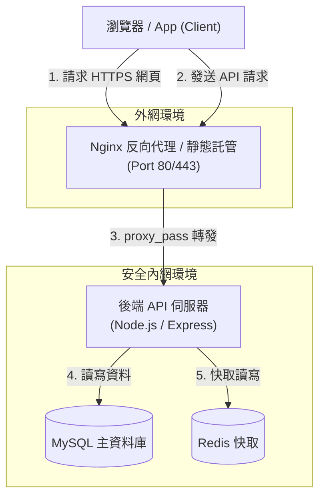

# Flowchart 流程與系統架構圖

流程圖 (`flowchart`) 用於展示步驟、判斷分支與系統組件之間的連通拓撲。這是最通用且實用的圖表。

### 📊 範例效果


### 📋 複製即用代碼 (請用 ```mermaid 包裹)

```text
flowchart TD
    Client["瀏覽器 / App (Client)"]
    
    subgraph PublicNet [外網環境]
        Nginx["Nginx 反向代理 / 靜態託管<br>(Port 80/443)"]
    end

    subgraph PrivateNet [安全內網環境]
        API["後端 API 伺服器<br>(Node.js / Express)"]
        DB[(MySQL 主資料庫)]
        Cache[(Redis 快取)]
    end

    Client -->|1. 請求 HTTPS 網頁| Nginx
    Client -->|2. 發送 API 請求| Nginx
    Nginx -->|3. proxy_pass 轉發| API
    API -->|4. 讀寫資料| DB
    API -->|5. 快取讀寫| Cache
```