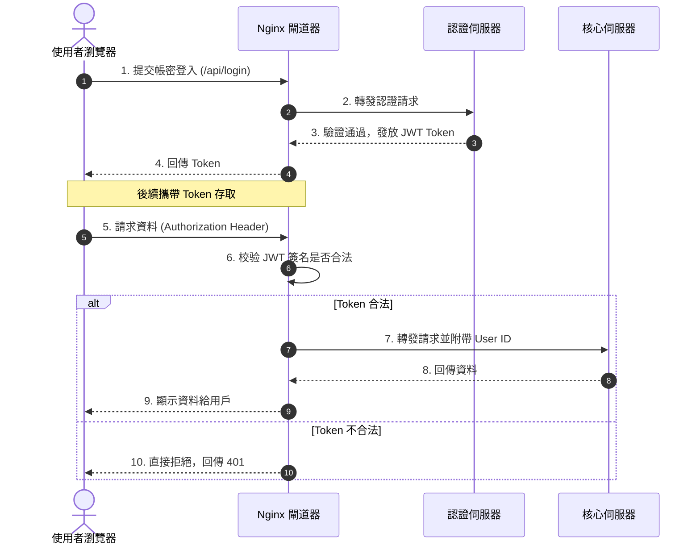

# Sequence Diagram API 交互時序圖

時序圖 (`sequenceDiagram`) 專門展示多個對象或系統之間，隨著「時間順序」發生的訊息往來與 API 呼叫流程。

### 📊 範例效果


### 📋 複製即用代碼 (請用 ```mermaid 包裹)

```text
sequenceDiagram
    autonumber
    actor User as 使用者瀏覽器
    participant Nginx as Nginx 閘道器
    participant Auth as 認證伺服器
    participant Core as 核心伺服器

    User->>Nginx: 1. 提交帳密登入 (/api/login)
    Nginx->>Auth: 2. 轉發認證請求
    Auth-->>Nginx: 3. 驗證通過，發放 JWT Token
    Nginx-->>User: 4. 回傳 Token
    
    Note over User, Nginx: 後續攜帶 Token 存取
    User->>Nginx: 5. 請求資料 (Authorization Header)
    Nginx->>Nginx: 6. 校验 JWT 簽名是否合法
    alt Token 合法
        Nginx->>Core: 7. 轉發請求並附帶 User ID
        Core-->>Nginx: 8. 回傳資料
        Nginx-->>User: 9. 顯示資料給用戶
    else Token 不合法
        Nginx-->>User: 10. 直接拒絕，回傳 401
    end
```