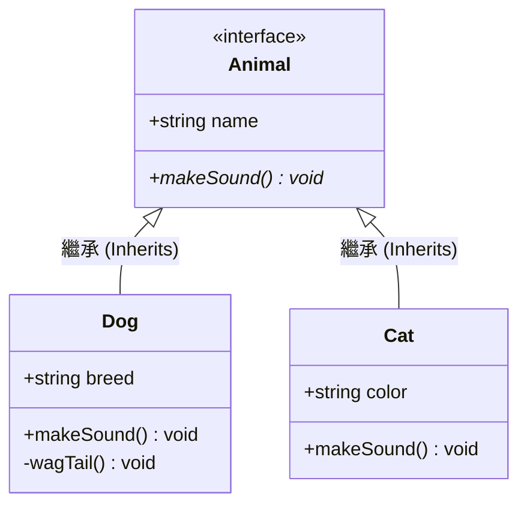

# Class Diagram 類別圖

類別圖 (`classDiagram`) 用於物件導向設計（OOP）中，展示類別（Class）或介面（Interface）的屬性、方法以及繼承與關聯關係。

### 📊 範例效果


### 📋 複製即用代碼 (請用 ```mermaid 包裹)

```text
classDiagram
    class Animal {
        <<interface>>
        +string name
        +makeSound()* void
    }
    class Dog {
        +string breed
        +makeSound() void
        -wagTail() void
    }
    class Cat {
        +string color
        +makeSound() void
    }
    
    Animal <|-- Dog : 繼承 (Inherits)
    Animal <|-- Cat : 繼承 (Inherits)
```