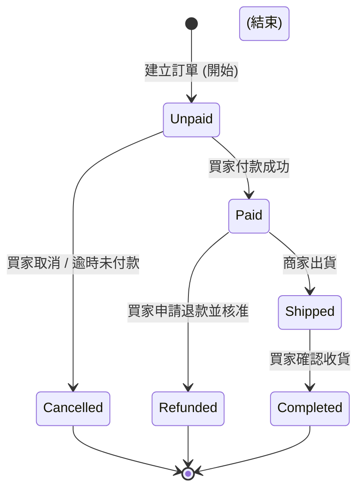

# State Diagram 狀態圖

狀態圖 (`stateDiagram-v2`) 用於展示系統或實體在不同事件觸發下的「狀態轉移」，例如訂單交易狀態、會員註冊審核狀態等。

### 📊 範例效果


### 📋 複製即用代碼 (請用 ```mermaid 包裹)

```text
stateDiagram-v2
    [*] --> Unpaid : 建立訂單 (開始)
    Unpaid --> Paid : 買家付款成功
    Unpaid --> Cancelled : 買家取消 / 逾時未付款
    
    Paid --> Shipped : 商家出貨
    Paid --> Refunded : 買家申請退款並核准
    
    Shipped --> Completed : 買家確認收貨
    
    Cancelled --> [*] (結束)
    Refunded --> [*] (結束)
    Completed --> [*] (結束)
```