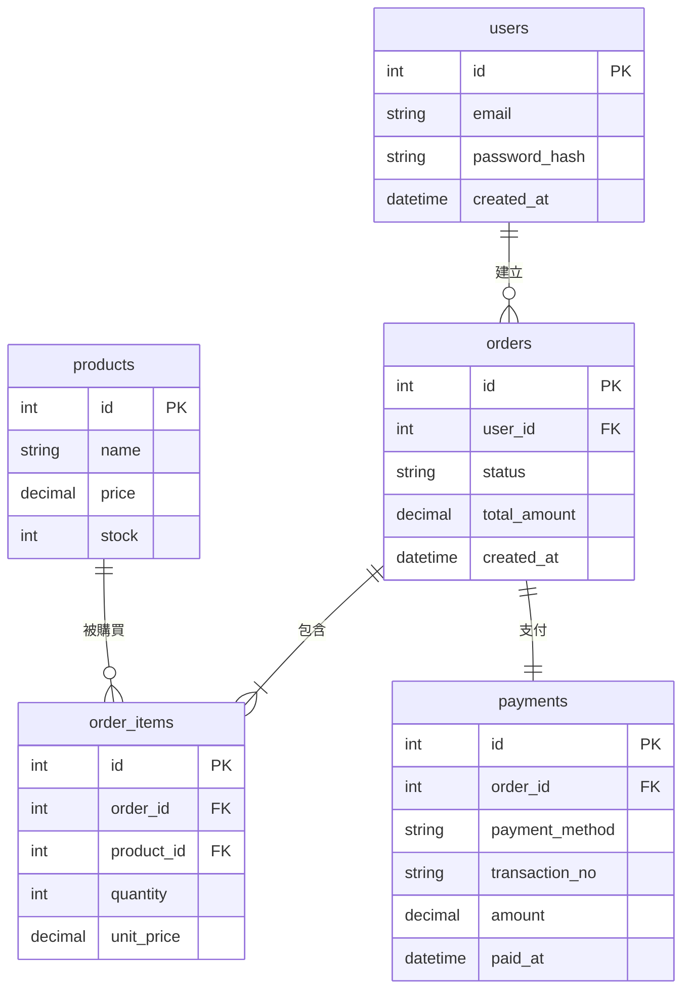

# Entity Relationship Diagram 資料庫關聯圖 (ERD)

實體關係圖 (`erDiagram`) 用於設計關係型資料庫的欄位結構，並宣告資料表之間的一對多、多對多關係。

### 📊 範例效果


### 📋 複製即用代碼 (請用 ```mermaid 包裹)

```text
erDiagram
    users ||--o{ orders : "建立"
    orders ||--|{ order_items : "包含"
    products ||--o{ order_items : "被購買"
    orders ||--|| payments : "支付"

    users {
        int id PK
        string email
        string password_hash
        datetime created_at
    }

    orders {
        int id PK
        int user_id FK
        string status
        decimal total_amount
        datetime created_at
    }

    order_items {
        int id PK
        int order_id FK
        int product_id FK
        int quantity
        decimal unit_price
    }

    products {
        int id PK
        string name
        decimal price
        int stock
    }

    payments {
        int id PK
        int order_id FK
        string payment_method
        string transaction_no
        decimal amount
        datetime paid_at
    }
```
