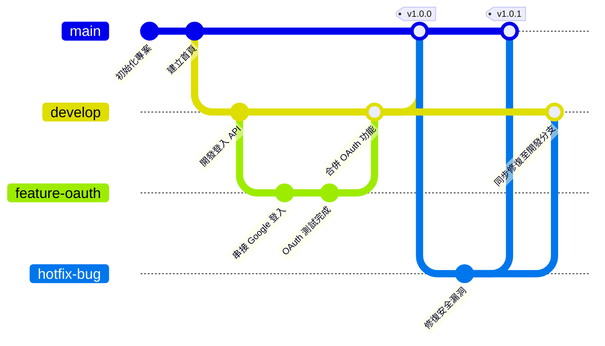

# GitGraph 版本控制分支管理圖

Git 分支圖 (`gitGraph`) 用於技術文檔中，展示團隊的分支開發流程（如 Git Flow 或 Trunk-based Development）。

### 📊 範例效果


### 📋 複製即用代碼 (請用 ```mermaid 包裹)

```text
gitGraph
    commit id: "初始化專案"
    commit id: "建立首頁"
    branch develop
    checkout develop
    commit id: "開發登入 API"
    branch feature-oauth
    checkout feature-oauth
    commit id: "串接 Google 登入"
    commit id: "OAuth 測試完成"
    checkout develop
    merge feature-oauth id: "合併 OAuth 功能"
    checkout main
    merge develop tag: "v1.0.0"
    branch hotfix-bug
    checkout hotfix-bug
    commit id: "修復安全漏洞"
    checkout main
    merge hotfix-bug tag: "v1.0.1"
    checkout develop
    merge hotfix-bug id: "同步修復至開發分支"
```