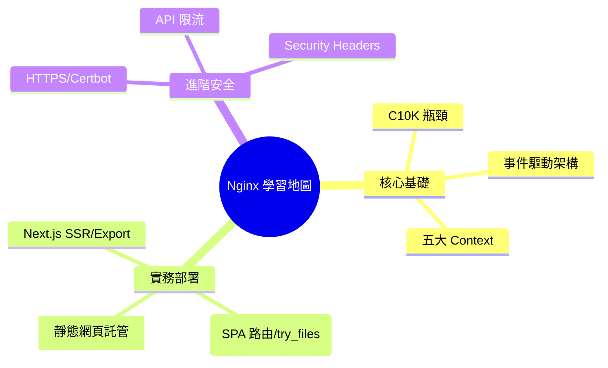

# Mindmap 思思導圖/心智圖

心智圖 (`mindmap`) 用於發散思考、整理大綱或分析知識樹狀結構。

### 📊 範例效果


### 📋 複製即用代碼 (請用 ```mermaid 包裹)

```text
mindmap
  root((Nginx 學習地圖))
    核心基礎
      C10K 瓶頸
      事件驅動架構
      五大 Context
    實務部署
      [靜態網頁託管]
      (SPA 路由/try_files)
      Next.js SSR/Export
    進階安全
      ::icon(fa fa-shield-halved)
      HTTPS/Certbot
      API 限流
      Security Headers
```
