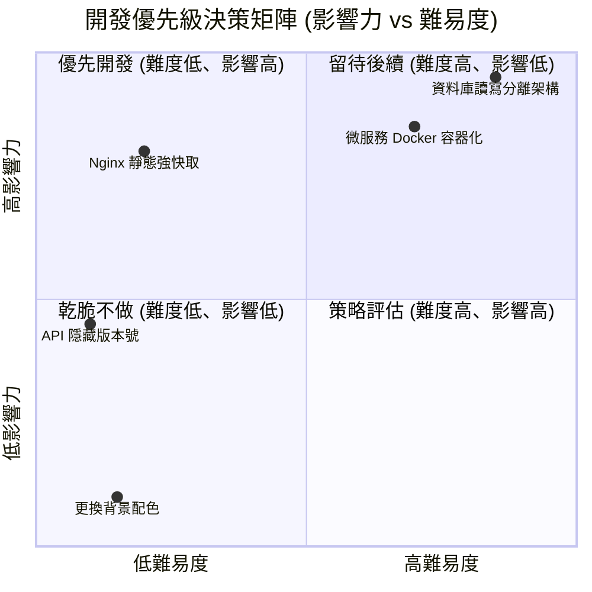

import Head from '@docusaurus/Head';

<Head>
  <script type="application/ld+json">
    {`
      {
        "@context": "https://schema.org",
        "@type": "Article",
        "headline": "Untitled",
        "datePublished": "2026-07-08T13:51:33.504Z",
        "author": [{
            "@type": "Person",
            "name": "liwen"
        }],
        "description": "Quadrant Chart 優先級決策象限圖 象限圖 quadrantChart 用於產品決策、功能優先順序排列（如影響力 vs 難易度）或是競品分析。 📊 範例效果 mermaid quadrantChart title 開發優先級決策矩陣 影響力 vs 難易度 xaxis 低難易度 > 高難..."
      }
    `}
  </script>
</Head>


# Quadrant Chart 優先級決策象限圖

象限圖 (`quadrantChart`) 用於產品決策、功能優先順序排列（如影響力 vs 難易度）或是競品分析。

### 📊 範例效果


### 📋 複製即用代碼 (請用 ```mermaid 包裹)

```text
quadrantChart
    title 開發優先級決策矩陣 (影響力 vs 難易度)
    x-axis 低難易度 --> 高難易度
    y-axis 低影響力 --> 高影響力
    quadrant-1 "留待後續 (難度高、影響低)"
    quadrant-2 "優先開發 (難度低、影響高)"
    quadrant-3 "乾脆不做 (難度低、影響低)"
    quadrant-4 "策略評估 (難度高、影響高)"
    Nginx 靜態強快取: [0.2, 0.8]
    API 隱藏版本號: [0.1, 0.45]
    資料庫讀寫分離架構: [0.85, 0.95]
    微服務 Docker 容器化: [0.7, 0.85]
    更換背景配色: [0.15, 0.1]
```