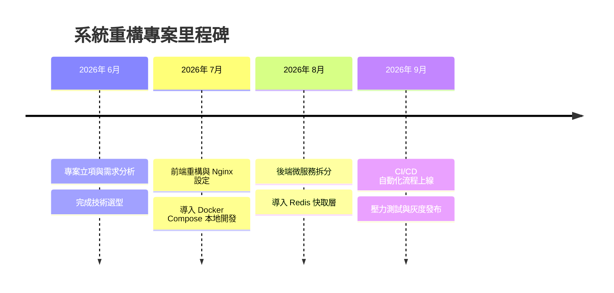

# Timeline 專案里程碑時間軸

時間軸 (`timeline`) 用於記錄線性時間下的專案大事記、版本更新歷史（Release Note）或開發里程碑。

### 📊 範例效果


### 📋 複製即用代碼 (請用 ```mermaid 包裹)

```text
timeline
    title 系統重構專案里程碑
    2026年 6月 : 專案立項與需求分析 : 完成技術選型
    2026年 7月 : 前端重構與 Nginx 設定 : 導入 Docker Compose 本地開發
    2026年 8月 : 後端微服務拆分 : 導入 Redis 快取層
    2026年 9月 : CI/CD 自動化流程上線 : 壓力測試與灰度發布
```
