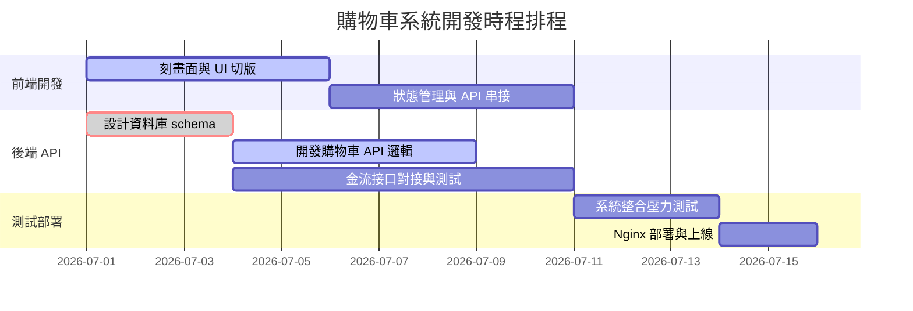

# Gantt Chart 專案進度甘特圖

甘特圖 (`gantt`) 用於排定多個工作模組、多人並行開發時的專案時程表，展示任務的起迄時間與相依關係。

### 📊 範例效果


### 📋 複製即用代碼 (請用 ```mermaid 包裹)

```text
gantt
    title 購物車系統開發時程排程
    dateFormat  YYYY-MM-DD
    section 前端開發
    刻畫面與 UI 切版            :active, des1, 2026-07-01, 5d
    狀態管理與 API 串接          :after des1, 5d
    section 後端 API
    設計資料庫 schema          :crit, done, des2, 2026-07-01, 3d
    開發購物車 API 邏輯         :active, after des2, 5d
    金流接口對接與測試         :after des2, 7d
    section 測試部署
    系統整合壓力測試           : 3d
    Nginx 部署與上線           : 2d
```
