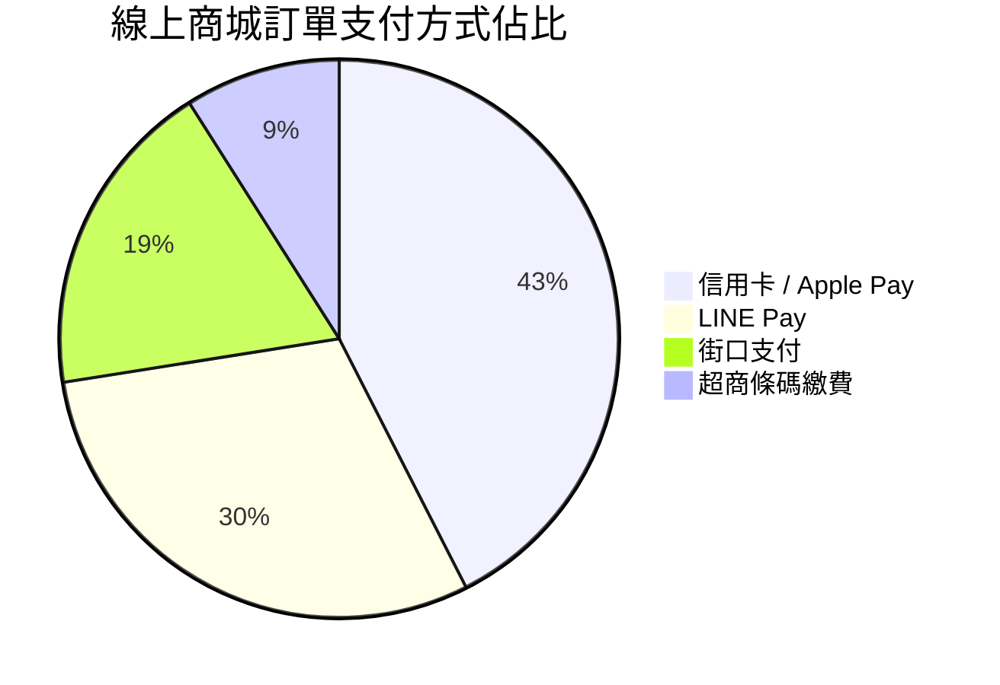

import Head from '@docusaurus/Head';

<Head>
  <script type="application/ld+json">
    {`
      {
        "@context": "https://schema.org",
        "@type": "Article",
        "headline": "Untitled",
        "datePublished": "2026-07-08T13:51:33.506Z",
        "author": [{
            "@type": "Person",
            "name": "liwen"
        }],
        "description": "Pie Chart 資料比例圓餅圖 圓餅圖 pie 用於直觀展示各類資料佔總體的比例分佈關係。 📊 範例效果 mermaid pie title 線上商城訂單支付方式佔比 \\"信用卡 / Apple Pay\\" : 42.5 \\"LINE Pay\\" : 30.0 \\"街口支付\\" : 18.5 \\"超商條碼繳..."
      }
    `}
  </script>
</Head>


# Pie Chart 資料比例圓餅圖

圓餅圖 (`pie`) 用於直觀展示各類資料佔總體的比例分佈關係。

### 📊 範例效果


### 📋 複製即用代碼 (請用 ```mermaid 包裹)

```text
pie
    title 線上商城訂單支付方式佔比
    "信用卡 / Apple Pay" : 42.5
    "LINE Pay" : 30.0
    "街口支付" : 18.5
    "超商條碼繳費" : 9.0
```