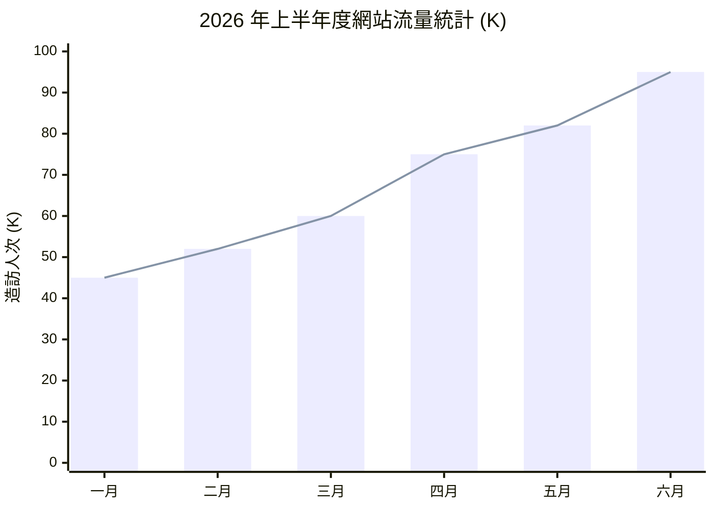

# XY Chart 數據柱狀與折線圖

XY 圖表 (`xychart-beta`) 能直接以數據點在 Markdown 檔案內渲染出帶有 X 軸、Y 軸的長條圖與折線圖。

### 📊 範例效果


### 📋 複製即用代碼 (請用 ```mermaid 包裹)

```text
xychart-beta
    title "2026 年上半年度網站流量統計 (K)"
    x-axis ["一月", "二月", "三月", "四月", "五月", "六月"]
    y-axis "造訪人次 (K)" 0 --> 100
    bar [45, 52, 60, 75, 82, 95]
    line [45, 52, 60, 75, 82, 95]
```