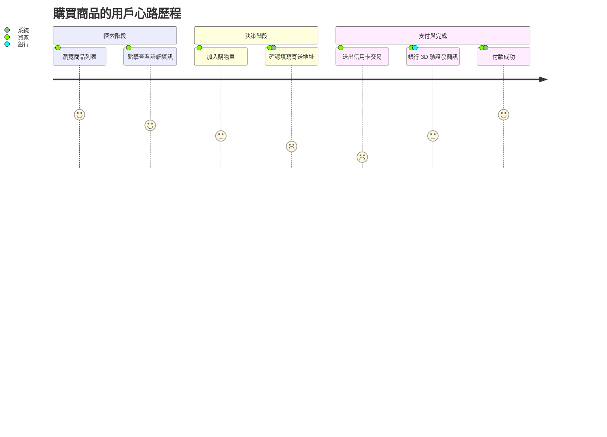

# User Journey 使用者旅程圖

使用者旅程圖 (`journey`) 用於 UX 體驗分析，記錄使用者完成特定任務（如買東西、註冊）的步驟、參與系統角色與情緒起伏指數。

### 📊 範例效果


### 📋 複製即用代碼 (請用 ```mermaid 包裹)

```text
journey
    title 購買商品的用戶心路歷程
    section 探索階段
      瀏覽商品列表: 5: 買家
      點擊查看詳細資訊: 4: 買家
    section 決策階段
      加入購物車: 3: 買家
      確認填寫寄送地址: 2: 買家, 系統
    section 支付與完成
      送出信用卡交易: 1: 買家
      銀行 3D 驗證發簡訊: 3: 買家, 銀行
      付款成功: 5: 買家, 系統
```