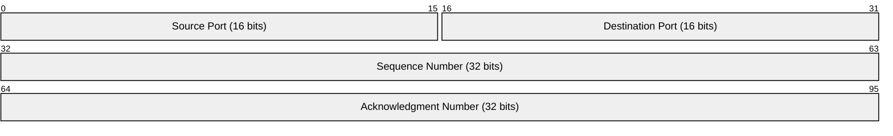

# Packet Diagram 網路封包結構圖

網路封包圖 (`packet`) 用於視覺化呈現二進位通訊協議（如 TCP/IP 封包）在各 Bit Offset 上的欄位佔用長度與功能結構。

### 📊 範例效果


### 📋 複製即用代碼 (請用 ```mermaid 包裹)

```text
packet-beta
0-15: "Source Port (16 bits)"
16-31: "Destination Port (16 bits)"
32-63: "Sequence Number (32 bits)"
64-95: "Acknowledgment Number (32 bits)"
```