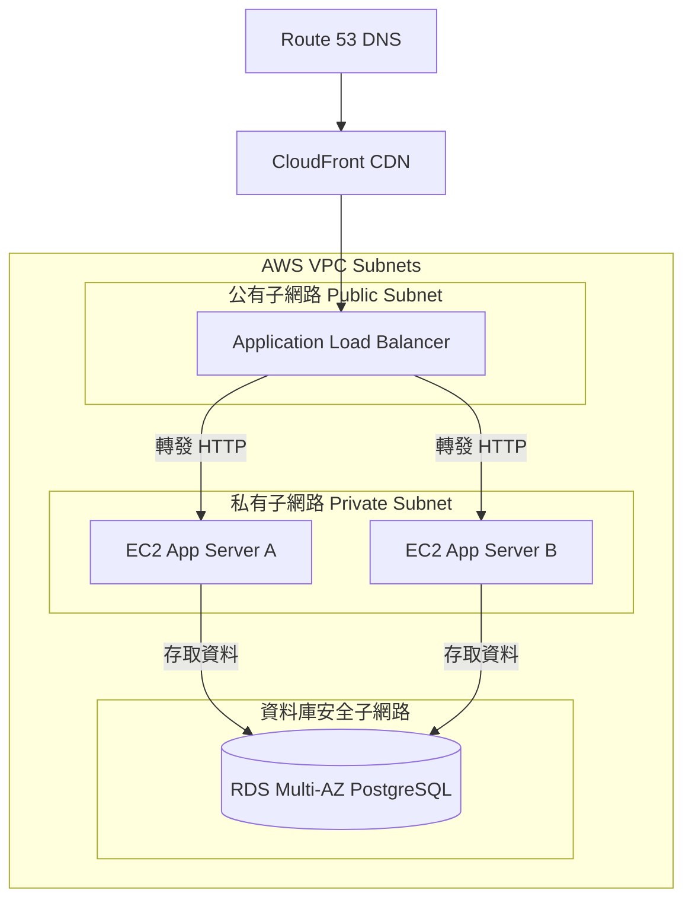

import Head from '@docusaurus/Head';

<Head>
  <script type="application/ld+json">
    {`
      {
        "@context": "https://schema.org",
        "@type": "Article",
        "headline": "Untitled",
        "datePublished": "2026-07-08T13:51:33.507Z",
        "author": [{
            "@type": "Person",
            "name": "liwen"
        }],
        "description": "Cloud Infrastructure 雲端基礎架構部署圖 基礎設施架構圖展示雲端服務（如 AWS Route 53, CloudFront, ALB, EC2, RDS）在不同虛擬私有網路安全子網段下的網路部署架構。 📊 範例效果 mermaid flowchart TD DNSRoute 5..."
      }
    `}
  </script>
</Head>


# Cloud Infrastructure 雲端基礎架構部署圖

基礎設施架構圖展示雲端服務（如 AWS Route 53, CloudFront, ALB, EC2, RDS）在不同虛擬私有網路安全子網段下的網路部署架構。

### 📊 範例效果


### 📋 複製即用代碼 (請用 ```mermaid 包裹)

```text
flowchart TD
    DNS[Route 53 DNS] --> CDN[CloudFront CDN]
    CDN --> ALB[Application Load Balancer]
    
    subgraph VPC [AWS VPC Subnets]
        subgraph PublicSubnet [公有子網路 Public Subnet]
            ALB
        end
        
        subgraph PrivateSubnet [私有子網路 Private Subnet]
            EC2_A[EC2 App Server A]
            EC2_B[EC2 App Server B]
            ALB -->|轉發 HTTP| EC2_A
            ALB -->|轉發 HTTP| EC2_B
        end
        
        subgraph DatabaseSubnet [資料庫安全子網路]
            RDS[(RDS Multi-AZ PostgreSQL)]
            EC2_A -->|存取資料| RDS
            EC2_B -->|存取資料| RDS
        end
    end
```